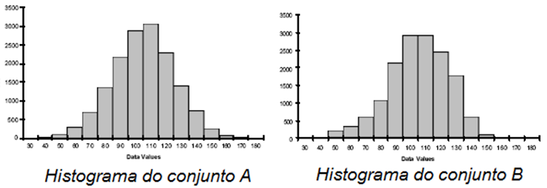
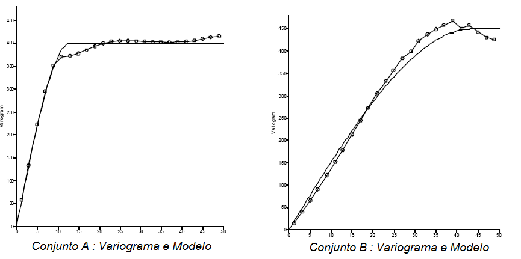
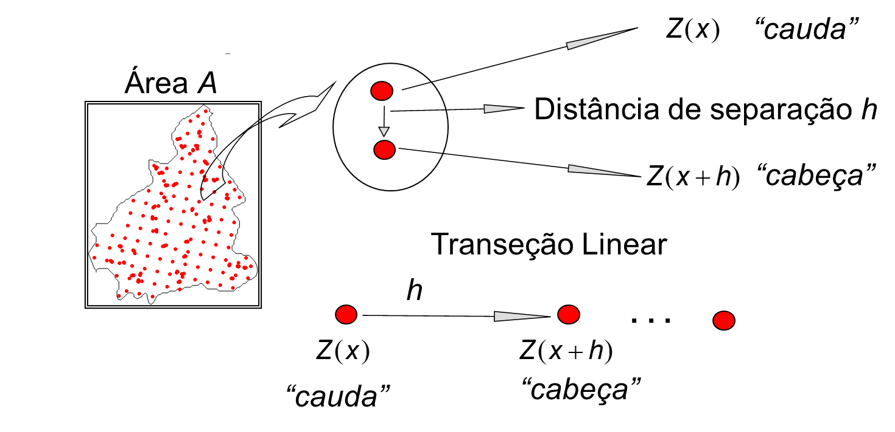
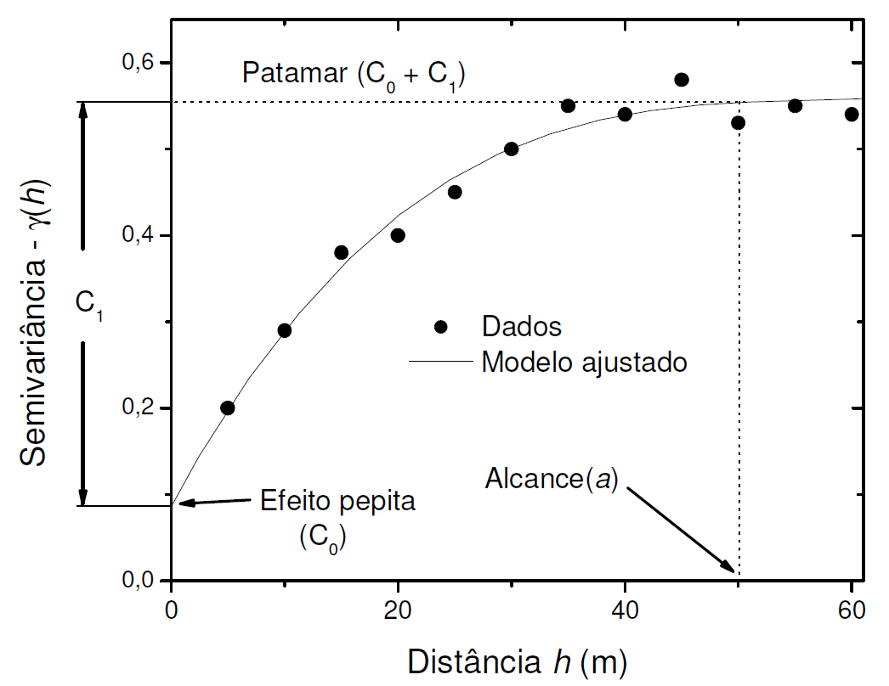

<!-- README.md is generated from README.Rmd. Please edit that file -->

```{r, include = FALSE}
knitr::opts_chunk$set(
  collapse = TRUE,
  warning = FALSE, 
  error = FALSE, 
  message = FALSE,
  echo = FALSE, eval = FALSE,
  comment = "#>"
)
```

# Cursos 02 - Introdução à Geoestatística    
## Ministrante: Prof. Alan Rodrigo Panosso 
## Data: 11/01/2024  


## Motivação

A Geoestatística é uma ferramenta na análise espacial de dados, desempenhando um importante papel na agricultura moderna. Ela combina princípios estatísticos com informações geográficas para fornecer uma compreensão mais profunda da variabilidade espacial de várias variáveis ligados ao solo, à planta e mesmo à atmosfera. 

Definida como um ramo da estatística aplicada que lida com a análise e interpretação de dados espaciais. Ela permite a modelagem da variabilidade espacial de fenômenos, descrevendo padrões espaciais, correlações e distribuições geográficas. No contexto agronômico, é uma ferramenta para compreender a heterogeneidade do solo e outros fatores que influenciam nos mais diversos fenômenos associados.

O objetivo deste curso é capacitar os alunos a utilizar os princípios da Geoestatística para analisar e interpretar dados espaciais. Ao final do curso, os participantes serão capazes de aplicar métodos geoestatísticos para mapear variáveis do solo, identificar padrões de distribuição espacial e tomar decisões informadas sobre práticas agrícolas.

## Introdução

Considere os dois conjuntos de dados $A$ e $B$ e suas respectivas estatísticas básicas.

Estatística |	A	| B 
:---| :---: | :---:
n	| $15251$	| $15251$
média | 	$100,0$	| $100,0$
desvio padrão	| $20,0$	| $20,0$
mediana	| $100,35$	| $100,92$
Percentil 10	| $73,89$	| $73,95$
Percentil  90	| $125,61$	| $124,72$



De acordo com estas evidências os dois conjuntos de dados são bastante semelhantes.


Comparação de seus respectivos gráficos de contornos (padrões espaciais).
 
  * O conjunto $A$ é mais acidentado que o conjunto de dados $B$.

  * Não se pode afirmar que o conjunto de dados $A$ é mais variável do que o conjunto $B$, haja visto que os desvios padrões dos dois conjuntos de dados foram iguais.

  * O conjunto $A$ muda mais rapidamente no espaço do que o conjunto $B$.
  
  * As zonas contínuas altos valores (em vermelho) e as zonas de baixos valores (em azul) são, em média, menores para o conjunto $A$ do que do conjunto $B$.
  
  * Estas diferenças podem ter um impacto significativo no delineamento amostral, na caracterização do local e na predição espacial em geral.

  > **Portanto, não é  surpresa que as estatísticas comuns falhem em reconhecer as diferenças da variável respostas dos dois exemplos de conjuntos de dados, isso porque a estatística descritiva e os histogramas não incorporam a localização espacial dos dados em seus cálculos**.  

## Definição da Geoestatística

Assim, podemos entender a geoestatística como estudos de fenômenos que variam no espaço e/ou no tempo, ou seja, é uma coleção de técnicas numéricas, que lidam com a caracterização de atributos espaciais, permitindo a descrição da continuidade espacial de fenômenos naturais e fornece adaptações das técnicas da regressão para o entendimento desta continuidade (ISAAKS; SRIVASTAVA, 1989; GOOVAERTS 1997). 

Embora ela tenha sua origem na mineração, a geoestatística é uma parte básica de muitas disciplinas científicas incluindo geosfísica, ciências agronômicas, hidrologia e engenharia ambiental. A parte central da geoestatística é a ideia de que **medidas mais próximas tendem a serem mais parecidas do que valores observados em locais distantes**. A geoestatística fornece métodos para quantificar esta correlação espacial e incorporá-la na estimação e na inferência (GOTWAY; HARTFORD).


## O variograma 

O variograma (ou semivariograma) é uma estatística descritiva quantitativa que pode ser representada graficamente de tal forma que caracteriza a continuidade espacial de um conjunto de dados.



Em outras palavras, a análise variográfica caracteriza a (auto) correlação espacial.

## Descrição do Experimento

Para esse estudo, as áreas selecionadas pertencem à Fazenda de Ensino, Pesquisa e Extensão (FEPE), da Faculdade de Engenharia de Ilha Solteira (FEIS - UNESP), localizada no município de Selvíria, estado do Mato Grosso do Sul.


No seu histórico, as áreas eram originalmente cobertas por vegetação nativa do Cerrado até a década de 1970, quando, em 1978, foram desmatadas e passaram a ser usadas para culturas anuais, como milho, soja, algodão e adubos verdes, até 1986. Durante os anos de 1986-1987, as áreas foram convertidas para os seguintes usos: floresta plantada de eucalipto (EU) e sistema silvipastoril (SI), uma floresta plantada de aroeira-vermelha (*Myracrodruon urundeuva*) em consórcio com capim braquiária (*Brachiaria decumbens*). A área de EU (*Eucalyptus camaldulensis*) foi formada em 26 de abril de 1986 e a área de SI foi formada em dezembro de 1987.

No momento da realização das avaliações de emissão de CO~2~ do solo (FCO2) as áreas já haviam passado por mais de $30$ anos de mudança de conversão. As determinações foram realizadas no período de 03 de fevereiro a 17 de junho de 2017, Na imagem abaixo são apresentados os dias de avaliação e os valores de precipitação (chuva em mm) ocorridas no período. 

Ao final do período de determinação da emissão de CO~2~ do solo, as amostras de solo foram coletadas e todos os atributos físicos e químicos foram determinados.


Aspectos gerais das áreas de estudo, silvipastoril (SI) e eucalipto (EU), ano de 2017, Município de Selvíria, Mato Grosso do Sul.


## Análise Exploratória

Um estudo clássico de geoestatística normalmente começa com uma descrição detalhada da análise exploratória dos dados (mapas espaciais, histogramas). Para isso vamos realizas análise descritiva da variável emissão de CO~2~ do solo na área de eucalipto. ([OLIVEIRA, 2018](https://repositorio.unesp.br/bitstreams/a13ca7aa-da94-4701-89aa-2bd2c8b4442d/download) )


### 1) Carregue os pacotes necessários para as analises

```{r}
library(tidyverse)
library(sp)
library(gstat)
library(corrplot)
```

### 2) Leia o banco de dados `geo_fco2.rds` disponível na pasta `data`. Utilize as funções glimpse e skim para um resumo inicial.

```{r}
geo_fco2 <- read_rds("data/geo_fco2.rds")
glimpse(geo_fco2)
skimr::skim(geo_fco2)
```

### 3) Quantos tratamentos temos nesse banco de dados? Ou seja, qual o número de categorias presentes na coluna `tratamento` ?

### 4) Recorte do banco de dados, selecionar somente a área de eucalipto.

```{r}
geo_fco2 %>% 
  filter(tratamento == "EU")
```

### 5) Apresente o gradeado amostral.

```{r}
geo_fco2 %>% 
  filter(tratamento == "EU") %>% 
  ggplot(aes(x,y)) + 
  geom_point() +
  theme_bw()
```
Observe a disposição dos pontos amostrais.

### 6) Mapeie a emissão de CO~2~ pelo tamanho e a cor dos marcadores de pontos.

```{r}
geo_fco2 %>% 
  filter(tratamento == "EU") %>% 
  mutate(fco2_class = cut(fco2, 5)) %>% 
  ggplot(aes(x, y, size = fco2_class,
             color = fco2_class)) + 
  geom_point() +
  theme_bw() +
  scale_color_brewer(palette = "Oranges")
```

### 7) Realize a estatística descritiva dos dados, contendo, `N, Média, Mediana, Mínimo, Máximo, Variância, Desvio Padrão, Assimetria, Curtose e Coeficiente de Variação`.

```{r}
geo_fco2 %>% 
  filter(tratamento == "EU") %>% 
  summarise(
    N = n(),
    Media = mean(fco2),
    Mediana = median(fco2),
    Minimo = min(fco2),
    Maximo = max(fco2),
    Variancia = var(fco2),
    Desv_Pad = sd(fco2),
    Assimetria = agricolae::skewness(fco2),
    Curtose = agricolae::kurtosis(fco2),
    CV = 100*Desv_Pad/Media
  )
```

### 8) Crie uma função para a estatística descritiva e aplique-a a todas as variáveis de interesse no banco de dados por meio das funções `summary` e `across`.

```{r}
my_func <- function(x){
  media <- mean(x)
  vari <- var(x)
  c(`MEDIA` = media, `VARIANCIA` = vari)
}

geo_fco2 %>% 
  summarise(
    across(
      fco2:k,my_func))

```
## Premissas ou pressupostos da análise geoestatística.

A análise geoestatística é baseada na teoria das **variáveis regionalizadas**, que é uma função numérica com distribuição espacial, que varia de um ponto a outro com continuidade aparente, mas cujas variações não podem ser representadas por uma função matemática simples (MATHERON, 1963). 

Uma variável regionalizada é uma variável aleatória que assume diferentes valores, de acordo com a sua posição na área de estudo.

Se todos os valores de uma variável regionalizada forem considerados em todos os pontos dentro de uma área amostral, a variável regionalizada é apenas uma de infinitas variáveis aleatórias. 

Esse conjunto é chamado de **função aleatória** e é simbolizado por $Z(x_i)$. Na prática, quando retiramos uma amostra de solo em um local com coordenadas definidas, temos apenas uma única realização da função aleatória. 

Para estimar valores em locais não amostrados, deve-se introduzir as restrições de **estacionaridade estatística**. A existência de estacionaridade permite que o experimento possa ser repetido mesmo que as amostras sejam coletadas em pontos diferentes, pois elas pertencem à mesma população, com os mesmos momentos estatísticos (VIEIRA, 2000).

Em resumo, temos que os métodos geoestatísticos são ótimos quando os dados são:
	
> **normalmente distribuídos** estacionários (média e variância não variam significativamente no espaço).

Desvios significativos da normalidade e da estacionariedade podem causar problemas, portanto é sempre importante começar o estudo estudando o histograma ou algum gráfico similar para checar a normalidade e o mapa dos valores no espaço para checar uma tendência significativa. 


### 9) Crie o histograma da variável `fco2`. Adicione os valores de `média`, `mediana`, `primeiro` e `terceiro quartil`

```{r}
geo_fco2 %>% 
  filter(tratamento == "EU") %>% 
  ggplot(aes(x=fco2)) +
  geom_histogram(bins=10)

```

### 10) Crie o gráfico Quantil-Quantil (QQ-plot) para auxiliar a interpretação da normalidade.

```{r}
geo_fco2 %>% 
  filter(tratamento == "EU") %>% 
  ggplot(aes(sample=fco2)) +
  stat_qq() +
  stat_qq_line()
```

### 11) Realize o teste de normalidade dos dados para `fco2`.

### 12) Verifique a presença de tendência nos dados em função das coordenadas `x` e `y`.

```{r}
geo_fco2 %>% 
  filter(tratamento == "EU") %>% 
  ggplot(aes(x=x, y=fco2)) +
  geom_point()
```

```{r}
geo_fco2 %>% 
  filter(tratamento == "EU") %>% 
  ggplot(aes(x=y, y=fco2)) +
  geom_point()
```

### 13) Realize a análise de regressão linear entre fco2 e as coordenadas x e y.
```{r}
geo_fco2 %>% 
  filter(tratamento == "EU") %>% 
  mutate(
    y2 = y*y,
    x2 = x*x
  ) %>% 
  lm(fco2 ~ y + y2 + x + x2, data=.) %>% 
  summary.lm()
```

## Medidas da dispersão conjunta de duas variáveis X e Y

As medidas de dispersão conjunta de duas variáveis, como X e Y, referem-se à extensão em que os valores dessas variáveis se afastam de seus valores médios simultaneamente. Algumas medidas comuns incluem a covariância e a correlação.

###  Covariância

A covariância $(Cov)$ indica a direção da relação linear entre duas variáveis. Se for positiva, sugere uma relação positiva (quando uma variável aumenta, a outra também tende a aumentar); se for negativa, indica uma relação negativa (uma variável aumenta enquanto a outra diminui).


Onde $X_i$ e $Y_i$ são os valores individuais das variáveis $X$ e $Y$, $\bar{X}$ e $\bar{Y}$ são as médias de $X$ e $Y$, e $n$ é o número de observações.

$$
Cov(X,Y) = \frac{1}{n}\sum\limits_{i=1}^n(X_i - \bar{X})(Y_i - \bar{Y})
$$

### Correlação

A correlação $(r)$ normaliza a covariância para estar entre $-1$ e $1$, facilitando a interpretação. Um valor próximo de $1$ indica uma forte relação positiva, $-1$ indica uma forte relação negativa, e $0$ indica ausência de relação linear.


Onde $S_X^2$ e $S_y^2$ são as variâncias de $X$ e $Y$, respectivamente.

### 14) Crie a matriz de correlação entre todas as variáveis numéricas do banco de dados.

```{r}
geo_fco2 %>% 
  filter(tratamento == "EU") %>% 
  select(fco2:k) %>% 
  cor() %>% 
  corrplot::corrplot(method = "ellipse",type = "upper")
```
## Definições em geoestatística

> Geoestatística lida com dados autocorrelacionados espacialmente.


> Autocorrelação: correlação entre elementos de uma série  com outros elementos da mesma série separados por uma uma determinada distância. (Oxford American Dictionary)

Covariância e a correlação são medidas de similaridade entre duas variáveis. Para estender este conceito para medidas de similaridade espacial, considere um gráfico de dispersão em que os pares de dados representam medidas da mesma variável separadas por uma distância $h$ uma da outra. 

Esta distância é geralmente denominada de `lag`, como usado nas series temporais.





## O semivariograma experimental (variograma experimental)

Ao contrário das funções de covariância e correlação, as quais medem a similaridade, o semivariograma experimental $\gamma(h)$ mede dissimilaridade média entre dados separados por um vetor $h$, ou seja,

$$
\gamma(h) = \frac{1}{2N(h)} \sum \limits_{i=1}^{N(h)}\left[ z(x_i) -z(x_i + h)\right]^2
$$

Sendo $z(x_i)$ e $z(x_i + h)$ os valores de cauda e da cabeça, respectivamente e $N(h)$ o número de pares de pontos separados pela distância $h$.

### 15) Vamos construir um semivariograma experimental:

#### 15.1) Extraia os vetores `x`, `y` e `z`.

```{r}
x <- geo_fco2 %>% 
  filter(tratamento == "EU") %>% 
  pull(x)

y <- geo_fco2 %>% 
  filter(tratamento == "EU") %>% 
  pull(y)

z <- geo_fco2 %>% 
  filter(tratamento == "EU") %>% 
  pull(fco2)
```

#### 15.2) Cosntrua as matrizes de distância e de valor de gamma.


```{r}
m_dist <- matrix(0,ncol = 102, nrow = 102)
dire <- m_2gamma <- m_dist
```

#### 15.3) Calcule a matriz de distância $D$ entre todos os pontos amostrais e a matriz de valores de gamma $\gamma$. Lembrando que

$$D = \sqrt{(X_2-X_1)^2+(Y_2-Y_1)^2}$$
e

$$\gamma = \left[ z(x_i) -z(x_i + h)\right]^2$$

, respectivamente:


```{r}
for(i in 1:102){
  for( j in 1:102){
    m_dist[i,j] = sqrt((x[i]-x[j])^2+(y[i]-y[j])^2)
    m_2gamma[i,j] = 1/2*(z[i]-z[j])^2
    dire[i,j] = atan((y[j]-y[i])/(x[j]-x[i]))*180/pi
  }
}
dire <- ifelse(dire < 0, dire* -1 + 180, dire)
table(m_dist) %>% plot()
abline(h=30)
```

#### 15.4) Calcule $h$, $N(h)$ e $\gamma(h)$.

```{r}
lag = 5
active_lag_distance = 50
h <- seq(5,active_lag_distance,lag)
direction <- n_h <- gamma <- h
for( i in seq_along(h)){
  if(i == 1){
    filtro <- m_dist > 0 & m_dist <= h[i]
    n_h[i] <- sum(filtro)/2
    gamma[i] <- sum(m_2gamma[filtro])/n_h[i]/2
    direction[i] = mean(dire[filtro])
  }else{
    filtro <- m_dist > h[i-1] & m_dist <= h[i]
    n_h[i] <- sum(filtro)/2
    gamma[i] <- sum(m_2gamma[filtro])/n_h[i]/2
    direction[i] = mean(dire[filtro])
  }
}
```

#### 15.5) Construa o semivariograma experimental $N(h)$ vs $\gamma(h)$.
```{r}
tibble(n_h, h,gamma, direction) %>% 
  ggplot(aes(x=h,y=gamma)) +
  geom_point() +
  theme_bw()
```

O gráfico de acima é denominado **semivariograma experimental**, o qual exibe um comportamento puramente aleatório ou sistemático que pode ser descrito por modelos matemáticos teóricos (linear, esférico, exponencial, gaussiano e lei de potência).


## Ajuste de modelos matemáticos ao semivariograma experimental

Os principais modelos a serem ajustados são:

#### a) Modelo exponencial:

$$\hat{\gamma}(h) = C_0 + C_1 \left[1- exp({-3 \frac{h}{a}}) \right], h > 0$$

#### b) Modelo esférico:

$$
\begin{cases}
\hat{\gamma}(h) = C_0 + C_1 [exp(\frac{3}{2}(\frac{h}{a})-\frac{1}{2}(\frac{h}{a})^3)], 0 \leq h \leq a \\
\hat{\gamma}(h) = C_0 + C_1, h>a
\end{cases}
$$

#### c) Modelo Gaussiano:

$$\hat{\gamma}(h) = C_0 + C_1 \left[1- exp(- \frac{h^2}{a^2}) \right], h > 0$$

```{r}
tibble(n_h, h,gamma, direction) %>% 
  ggplot(aes(x=h,y=gamma)) +
  geom_point() +
  theme_bw() +
  stat_smooth(method = "nls", formula = 'y~c0+c1*(1-exp(-3*x/a))',
              method.args = list(start = c(c0=0.1,
                                           c1=1.8,
                                           a=25)),
              se=FALSE,color = "red") +
  stat_smooth(method = "nls", formula = 'y~c0+c1*exp(-3/2*x/a-1/2*(x/a)^3)',
              method.args = list(start = c(c0=0.1,
                                           c1=1.8,
                                           a=20)),
              se=FALSE,color = "blue") +
  stat_smooth(method = "nls", formula = 'y~c0+c1*(1-exp(-x^2/a^2))',
              method.args = list(start = c(c0=0.1,
                                           c1=1.8,
                                           a=25)),
              se=FALSE,color = "darkgreen")
```

## Interpretação dos parâmetros



Para variáveis que apresentam dependência espacial, espera-se que os valores de $Z(x_i) – Z(x_i + h)$ aumentem com a distância $h$ até determinada distância, a partir da qual os valores estabilizam.

O valor de semivariância, na qual ocorre a estabilização do semivariograma, é denominado de **patamar (sill)**, representado pelo símbolo $C_0 + C_1$, sendo aproximadamente igual ao valor da estimativa da variância dos dados analisados.


A distância $h$ na qual ocorre a estabilização do semivariograma é denominada de **alcance (range)**, simbolizado por $a$, e define o limite da dependência espacial (autocorrelação). Na prática, pontos cuja distância entre eles **seja maior** que o valor de $a$, não apresentam autocorrelação espacial, ou seja, são aleatórios.

O **efeito pepita (nugget effect)**, representado pelo símbolo $C_0$, é o valor de semivariância encontrado no intercepto do modelo ajustado com o eixo $Y$. Teoricamente, este valor deve ser zero para uma distância de separação $(h)$ igual a zero; entretanto, erros de amostragem e a variabilidade na pequena escala podem causar desvio do zero para esse parâmetro. Portanto, o efeito pepita representa a quantidade de variância não explicada ou modelada como correlação espacial.

O valor $C_1$ representa a estrutura de variabilidade espacial dos dados

```{r}
df_aux <- geo_fco2 %>% 
  filter(tratamento == "EU") %>% 
  select(x,y,fco2) %>% 
  rename(z=fco2)
```

```{r}
coordinates(df_aux) = ~ x + y
formula <- z ~ 1
variograma <- variogram(formula,df_aux)
variograma %>% 
  ggplot(aes(x=dist, y=gamma)) +
  geom_point()
```

## Referências

GOTWAY, C.A.; HARTFORD, A.H. 1996. Geostatistical methods for incorporating auxiliary information in the prediction of spatial variables. **J. Agric., Biol. Environ. Statis.**, 1: 17-39.

GOOVAERTS, P. **Geostatistics for natural resources evaluation**. New York: Oxford University Press, p. 483, 1997.

ISAAKS, E. H.; SRIVASTAVA, R. M. **Applied geostatistics**. Nova York: Oxford University Press, 1989. 561 p.

JOURNEL, A.G. **Fundamentals of geostatistics in five lessons**. Short Course in Geology: Volume 8. American Geophysical Union, Washington, p. 1 – 40, 1989.

MATHERON G. Principles of geostatistics. **Economic Geology**, 58, 1963, 1246-1266.

OLIVEIRA, C. F. **Variabilidade espacial da emissão de CO~2~ e estoque de carbono do solo em áreas de eucalipto e sistema silvipastoril**. Dissertação de Mestrado, Agronomia, UNESP-FEIS, 2018.

VIEIRA, S. R. **Geoestatística em estudos de variabilidade espacial do solo**. In: NOVAIS, R.F.; ALVAREZ, V. H.; SEHAFFER, C. E. G. R. (Ed). Tópicos em ciência do solo. Viçosa: Sociedade Brasileira de Ciência do Solo, 2000, v.1, p. 1 – 53. 

WEBSTER, R., OLIVER, M. **Geostatistics for Environmental Sciences**. San Francisco: John Wiley & Sons, p. 315, 2009.

