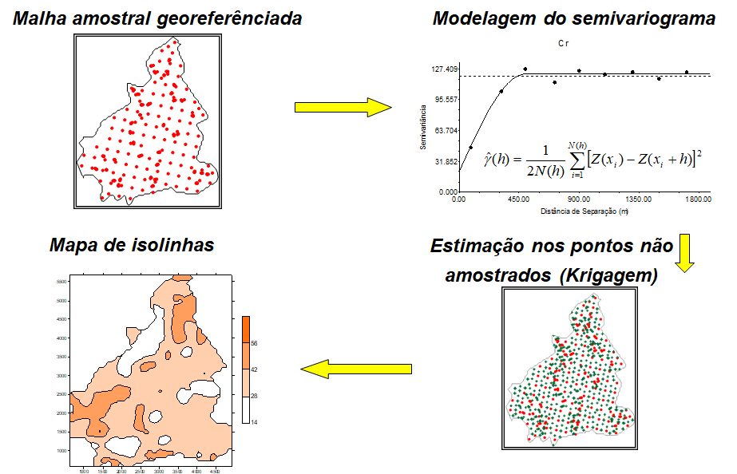
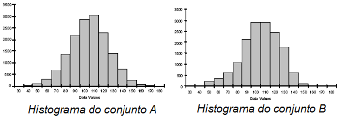
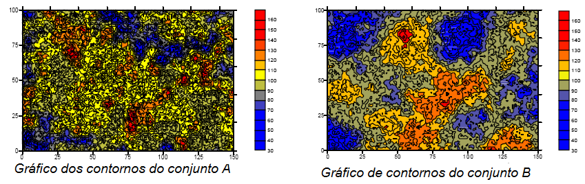

<!-- README.md is generated from README.Rmd. Please edit that file -->

# Cursos 02 - Introdução à Geoestatística

## Ministrante: Prof. Alan Rodrigo Panosso

## Data: 11/01/2024

## Motivação

A Geoestatística é uma ferramenta na análise espacial de dados,
desempenhando um importante papel na agricultura moderna. Ela combina
princípios estatísticos com informações geográficas para fornecer uma
compreensão mais profunda da variabilidade espacial de várias variáveis
ligados ao solo, à planta e mesmo à atmosfera.

Definida como um ramo da estatística aplicada que lida com a análise e
interpretação de dados espaciais. Ela permite a modelagem da
variabilidade espacial de fenômenos, descrevendo padrões espaciais,
correlações e distribuições geográficas. No contexto agronômico, é uma
ferramenta para compreender a heterogeneidade do solo e outros fatores
que influenciam nos mais diversos fenômenos associados.

O objetivo deste curso é capacitar os alunos a utilizar os princípios da
Geoestatística para analisar e interpretar dados espaciais. Ao final do
curso, os participantes serão capazes de aplicar métodos geoestatísticos
para mapear variáveis do solo, identificar padrões de distribuição
espacial e tomar decisões informadas sobre práticas agrícolas.

## Introdução

Considere os dois conjuntos de dados $A$ e $B$ e suas respectivas
estatísticas básicas.

| Estatística   |    A     |    B     |
|:--------------|:--------:|:--------:|
| n             | $15251$  | $15251$  |
| média         | $100,0$  | $100,0$  |
| desvio padrão |  $20,0$  |  $20,0$  |
| mediana       | $100,35$ | $100,92$ |
| Percentil 10  | $73,89$  | $73,95$  |
| Percentil 90  | $125,61$ | $124,72$ |

De acordo com estas evidências os dois conjuntos de dados são bastante
semelhantes.

 Comparação de seus respectivos gráficos de contornos
(padrões espaciais).

- O conjunto $A$ é mais acidentado que o conjunto de dados $B$.

- Não se pode afirmar que o conjunto de dados $A$ é mais variável do que
  o conjunto $B$, haja visto que os desvios padrões dos dois conjuntos
  de dados foram iguais.

- O conjunto $A$ muda mais rapidamente no espaço do que o conjunto $B$.

- As zonas contínuas altos valores (em vermelho) e as zonas de baixos
  valores (em azul) são, em média, menores para o conjunto $A$ do que do
  conjunto $B$.

- Estas diferenças podem ter um impacto significativo no delineamento
  amostral, na caracterização do local e na predição espacial em geral.

> **Portanto, não é surpresa que as estatísticas comuns falhem em
> reconhecer as diferenças da variável respostas dos dois exemplos de
> conjuntos de dados, isso porque a estatística descritiva e os
> histogramas não incorporam a localização espacial dos dados em seus
> cálculos**.

## Definição da Geoestatística

Assim, podemos entender a geoestatística como estudos de fenômenos que
variam no espaço e/ou no tempo, ou seja, é uma coleção de técnicas
numéricas, que lidam com a caracterização de atributos espaciais,
permitindo a descrição da continuidade espacial de fenômenos naturais e
fornece adaptações das técnicas da regressão para o entendimento desta
continuidade (ISAAKS; SRIVASTAVA, 1989; GOOVAERTS 1997).

Embora ela tenha sua origem na mineração, a geoestatística é uma parte
básica de muitas disciplinas científicas incluindo as ciências do solo,
geosfísica, hidrologia e engenharia ambiental. A parte central da
geoestatística é a ideia de que **medidas mais próximas tendem a serem
mais parecidas do que valores observados em locais distantes**. A
geoestatística fornece métodos para quantificar esta correlação espacial
e incorporá-la na estimação e na inferência (GOTWAY; HARTFORD).

## 

## Referências

GOTWAY, C.A.; HARTFORD, A.H. 1996. Geostatistical methods for
incorporating auxiliary information in the prediction of spatial
variables. **J. Agric., Biol. Environ. Statis.**, 1: 17-39.

GOOVAERTS, P. **Geostatistics for natural resources evaluation**. New
York: Oxford University Press, p. 483, 1997.

ISAAKS, E. H.; SRIVASTAVA, R. M. **Applied geostatistics**. Nova York:
Oxford University Press, 1989. 561 p.
