<!-- README.md is generated from README.Rmd. Please edit that file -->

# Cursos 02 - Introdução à Geoestatística

## Ministrante: Prof. Alan Rodrigo Panosso

## Data: 11/01/2024


## Motivação

A Geoestatística é uma ferramenta na análise espacial de dados,
desempenhando um importante papel na agricultura moderna. Ela combina
princípios estatísticos com informações geográficas para fornecer uma
compreensão mais profunda da variabilidade espacial de várias variáveis
ligadas ao solo, às plantas e mesmo à atmosfera.

É definida como um ramo da estatística aplicada que lida com a análise e
interpretação de dados espaciais. Ela permite a modelagem da
variabilidade espacial de fenômenos, descrevendo padrões espaciais,
correlações e distribuições geográficas. No contexto agronômico, é uma
ferramenta para compreender a heterogeneidade do solo e outros fatores
que influenciam nos mais diversos fenômenos associados.

O objetivo deste curso é capacitar os alunos a utilizar os princípios da
Geoestatística para analisar e interpretar dados espaciais. Ao final do
curso, os participantes serão capazes de aplicar métodos geoestatísticos
para mapear variáveis do solo, identificar padrões de distribuição
espacial e tomar decisões informadas sobre práticas agrícolas.

## Introdução

Considere os dois conjuntos de dados $A$ e $B$ e suas respectivas
estatísticas básicas.

| Estatística   |    A     |    B     |
|:--------------|:--------:|:--------:|
| n             | $15251$  | $15251$  |
| média         | $100,0$  | $100,0$  |
| desvio padrão |  $20,0$  |  $20,0$  |
| mediana       | $100,35$ | $100,92$ |
| Percentil 10  | $73,89$  | $73,95$  |
| Percentil 90  | $125,61$ | $124,72$ |


De acordo com estas evidências os dois conjuntos de dados são bastante
semelhantes.

 Comparação de seus respectivos gráficos de contornos
(padrões espaciais).

- O conjunto $A$ é mais acidentado que o conjunto de dados $B$.

- Não se pode afirmar que o conjunto de dados $A$ é mais variável do que
  o conjunto $B$, haja visto que os desvios padrões dos dois conjuntos
  de dados foram iguais.

- O conjunto $A$ muda mais rapidamente no espaço do que o conjunto $B$.

- As zonas contínuas altos valores (em vermelho) e as zonas de baixos
  valores (em azul) são, em média, menores para o conjunto $A$ do que do
  conjunto $B$.

- Estas diferenças podem ter um impacto significativo no delineamento
  amostral, na caracterização do local e na predição espacial em geral.

> **Portanto, não é surpresa que as estatísticas comuns falhem em
> reconhecer as diferenças da variável respostas dos dois exemplos de
> conjuntos de dados, isso porque a estatística descritiva e os
> histogramas não incorporam a localização espacial dos dados em seus
> cálculos**.

## Definição da Geoestatística

Podemos entender a geoestatística como estudos de fenômenos que variam
no espaço e/ou no tempo, ou seja, é uma coleção de técnicas numéricas,
que lidam com a caracterização de atributos espaciais, permitindo a
descrição da continuidade espacial de fenômenos naturais e fornece
adaptações das técnicas da regressão para o entendimento desta
continuidade (ISAAKS; SRIVASTAVA, 1989; GOOVAERTS, 1997).

Embora ela tenha sua origem na mineração, a geoestatística é uma parte
básica de muitas disciplinas científicas incluindo geosfísica, ciências
agronômicas, hidrologia e engenharia ambiental. A parte central da
geoestatística é a ideia de que **medidas mais próximas tendem a serem
mais parecidas do que valores observados em locais distantes**. A
geoestatística fornece métodos para quantificar esta correlação espacial
e incorporá-la na estimação e na inferência (GOTWAY; HARTFORD).

## O variograma

O variograma (ou semivariograma) é uma estatística descritiva
quantitativa que pode ser representada graficamente de tal forma que
caracteriza a continuidade espacial de um conjunto de dados.

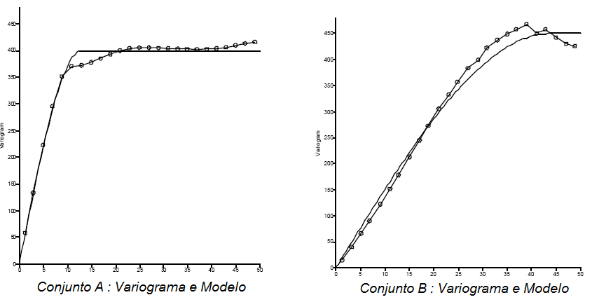

Em outras palavras, a análise variográfica caracteriza a
(auto)correlação espacial.

## Descrição do Experimento

Para esse cruso foi selecionado um estudo desenvolvido em áreas
pertencentes à Fazenda de Ensino, Pesquisa e Extensão (FEPE), da
Faculdade de Engenharia de Ilha Solteira (FEIS - UNESP), localizada no
município de Selvíria, estado do Mato Grosso do Sul.

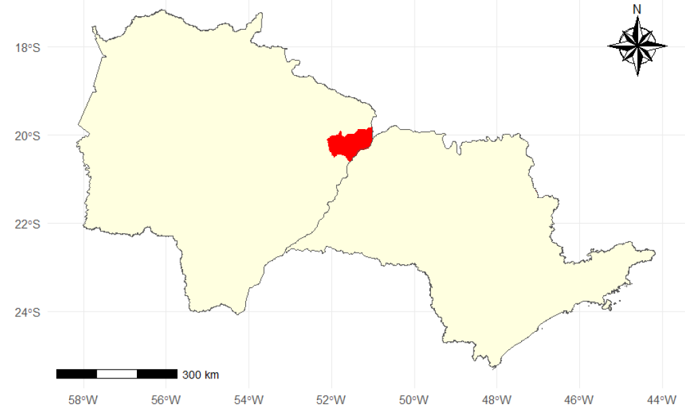

No seu histórico, as áreas eram originalmente cobertas por vegetação
nativa do Cerrado até a década de 1970, quando, em 1978, foram
desmatadas e passaram a ser usadas para culturas anuais, como milho,
soja, algodão e adubos verdes, até 1986. Durante os anos de 1986-1987,
as áreas foram convertidas para os seguintes usos: floresta plantada de
eucalipto (EU) e sistema silvipastoril (SI), uma floresta plantada de
aroeira-vermelha (*Myracrodruon urundeuva*) em consórcio com capim
braquiária (*Brachiaria decumbens*). A área de EU (*Eucalyptus
camaldulensis*) foi formada em 26 de abril de 1986 e a área de SI foi
formada em dezembro de 1987.

No momento da realização das avaliações de emissão de CO<sub>2</sub> do
solo (FCO2) as áreas já haviam passado por mais de $30$ anos de mudança
de conversão. As determinações foram realizadas no período de 03 de
fevereiro a 17 de junho de 2017, Na imagem abaixo são apresentados os
dias de avaliação e os valores de precipitação (chuva em mm) ocorridas
no período.

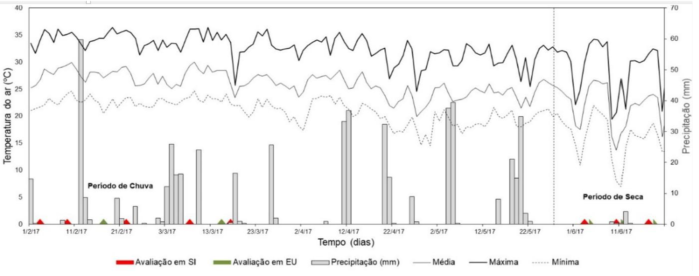

Ao final do período de determinação da emissão de CO<sub>2</sub> do
solo, as amostras de solo foram coletadas e todos os atributos físicos e
químicos foram determinados.

Aspectos gerais das áreas de estudo, silvipastoril (SI) e eucalipto
(EU), ano de 2017, Município de Selvíria, Mato Grosso do Sul.

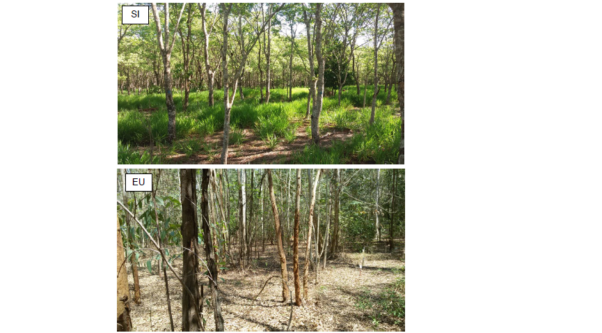

## Análise Exploratória

Um estudo clássico de geoestatística normalmente começa com uma
descrição detalhada da análise exploratória dos dados (mapas espaciais,
histogramas). Para isso vamos realizas análise descritiva da variável
emissão de CO<sub>2</sub> do solo na área de eucalipto. ([OLIVEIRA,
2018](https://repositorio.unesp.br/bitstreams/a13ca7aa-da94-4701-89aa-2bd2c8b4442d/download)
)

### 1) Carregue os pacotes necessários para as analises

``` r
# Instalar pacotes necessários
# install.packages("tidyverse")
# install.packages("sp")
# install.packages("gstat")
# install.packages("corrplot")
# install.packages("skimr")
# install.packages("agricolae")

# Carregar os pacotes
library(tidyverse)
library(sp)
library(gstat)
library(corrplot)
source("R/my-functions.R")
```

### 2) Leia o banco de dados `geo_fco2.rds` disponível na pasta `data`. Utilize as funções `glimpse` e `skim`, dos pacotes `{dplyr}` e `{skimr}` para a apresentação de um resumo inicial do banco de dados.

``` r
# Lendo o banco de dados
dados_geo <- read_rds("data/geo_fco2.rds")
glimpse(dados_geo)
#> Rows: 188
#> Columns: 11
#> $ tratamento <chr> "EU", "EU", "EU", "EU", "EU", "EU", "EU", "EU", "EU", "EU",…
#> $ id         <dbl> 1, 2, 3, 4, 5, 6, 7, 8, 9, 10, 11, 12, 13, 14, 15, 16, 17, …
#> $ x          <dbl> 0, 20, 40, 60, 80, 100, 10, 15, 20, 25, 30, 50, 55, 60, 65,…
#> $ y          <dbl> 0, 0, 0, 0, 0, 0, 10, 10, 10, 10, 10, 10, 10, 10, 10, 10, 1…
#> $ fco2       <dbl> 5.164, 4.528, 5.048, 5.298, 6.576, 5.124, 10.356, 5.044, 5.…
#> $ ts         <dbl> 23.98, 24.68, 24.36, 24.56, 24.48, 24.48, 25.18, 24.86, 25.…
#> $ us         <dbl> 11.664611, 6.956307, 9.709750, 6.726249, 9.388142, 8.494171…
#> $ mo         <dbl> 31, 32, 39, 38, 29, 31, 27, 29, 22, 24, 29, 24, 35, 28, 43,…
#> $ p_h        <dbl> 4.4, 3.8, 3.7, 3.9, 4.0, 4.0, 3.7, 3.9, 3.8, 3.8, 3.9, 4.2,…
#> $ p_resina   <dbl> 3, 6, 6, 5, 4, 5, 5, 4, 4, 4, 5, 4, 9, 5, 6, 7, 5, 3, 4, 3,…
#> $ k          <dbl> 0.8, 1.9, 1.4, 0.9, 0.9, 0.6, 1.1, 0.8, 0.7, 0.7, 1.0, 0.8,…
skimr::skim(dados_geo)
```

|                                                  |           |
|:-------------------------------------------------|:----------|
| Name                                             | dados_geo |
| Number of rows                                   | 188       |
| Number of columns                                | 11        |
| \_\_\_\_\_\_\_\_\_\_\_\_\_\_\_\_\_\_\_\_\_\_\_   |           |
| Column type frequency:                           |           |
| character                                        | 1         |
| numeric                                          | 10        |
| \_\_\_\_\_\_\_\_\_\_\_\_\_\_\_\_\_\_\_\_\_\_\_\_ |           |
| Group variables                                  | None      |

Data summary

**Variable type: character**

| skim_variable | n_missing | complete_rate | min | max | empty | n_unique | whitespace |
|:--------------|----------:|--------------:|----:|----:|------:|---------:|-----------:|
| tratamento    |         0 |             1 |   2 |   2 |     0 |        2 |          0 |

**Variable type: numeric**

| skim_variable | n_missing | complete_rate |  mean |    sd |    p0 |   p25 |   p50 |   p75 |   p100 | hist  |
|:--------------|----------:|--------------:|------:|------:|------:|------:|------:|------:|-------:|:------|
| id            |         0 |             1 | 47.84 | 27.79 |  1.00 | 24.00 | 47.50 | 71.00 | 102.00 | ▇▇▇▇▅ |
| x             |         0 |             1 | 54.52 | 33.79 |  0.00 | 25.00 | 55.00 | 80.00 | 120.00 | ▇▆▇▅▅ |
| y             |         0 |             1 | 38.14 | 27.46 |  0.00 | 20.00 | 30.00 | 60.00 | 100.00 | ▇▆▂▃▂ |
| fco2          |         0 |             1 |  4.39 |  1.26 |  2.01 |  3.54 |  4.23 |  5.03 |  10.36 | ▅▇▂▁▁ |
| ts            |         0 |             1 | 24.66 |  0.58 | 23.60 | 24.26 | 24.55 | 24.95 |  27.01 | ▅▇▃▁▁ |
| us            |         0 |             1 | 15.57 |  5.68 |  4.26 | 10.39 | 13.78 | 21.06 |  24.31 | ▁▇▁▂▆ |
| mo            |         0 |             1 | 30.33 |  5.00 | 15.00 | 27.00 | 30.00 | 33.00 |  45.00 | ▁▃▇▃▁ |
| p_h           |         0 |             1 |  4.15 |  0.36 |  3.50 |  3.90 |  4.00 |  4.30 |   5.70 | ▅▇▂▁▁ |
| p_resina      |         0 |             1 |  4.99 |  2.38 |  1.00 |  3.00 |  5.00 |  6.00 |  17.00 | ▇▆▂▁▁ |
| k             |         0 |             1 |  2.15 |  1.41 |  0.60 |  1.20 |  1.70 |  2.62 |  11.50 | ▇▂▁▁▁ |

### 3) Quantos tratamentos temos nesse banco de dados? Ou seja, qual o número de categorias presentes na coluna `tratamento` ?

``` r
# Número de categorias de tratamentos
dados_geo |>
  pull(tratamento) |>
  unique()
#> [1] "EU" "SI"
```

### 4) Filtrar do banco de dados, selecionar somente as observações referentes à área de eucalipto.

``` r
# Filtrar as observações para o tratamento "EU"
dados_geo |>
  filter(tratamento == "EU")
#> # A tibble: 102 × 11
#>    tratamento    id     x     y  fco2    ts    us    mo   p_h p_resina     k
#>    <chr>      <dbl> <dbl> <dbl> <dbl> <dbl> <dbl> <dbl> <dbl>    <dbl> <dbl>
#>  1 EU             1     0     0  5.16  24.0 11.7     31   4.4        3   0.8
#>  2 EU             2    20     0  4.53  24.7  6.96    32   3.8        6   1.9
#>  3 EU             3    40     0  5.05  24.4  9.71    39   3.7        6   1.4
#>  4 EU             4    60     0  5.30  24.6  6.73    38   3.9        5   0.9
#>  5 EU             5    80     0  6.58  24.5  9.39    29   4          4   0.9
#>  6 EU             6   100     0  5.12  24.5  8.49    31   4          5   0.6
#>  7 EU             7    10    10 10.4   25.2 10.2     27   3.7        5   1.1
#>  8 EU             8    15    10  5.04  24.9  9.43    29   3.9        4   0.8
#>  9 EU             9    20    10  5.27  25.0  5.21    22   3.8        4   0.7
#> 10 EU            10    25    10  4.77  24.6  9.36    24   3.8        4   0.7
#> # ℹ 92 more rows
```

### 5) Apresente o gradeado amostral.

``` r
dados_geo |>
  filter(tratamento == "EU") |>
  ggplot(aes(x=x, y=y)) +
  geom_point() +
  theme_bw()
```

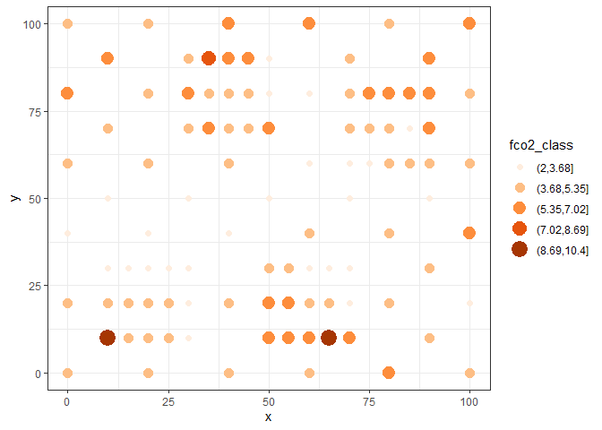<!-- --> Observe a
disposição dos pontos amostrais.

### 6) Mapeie a emissão de CO<sub>2</sub> pelo tamanho e a cor dos marcadores de pontos.

``` r
dados_geo |>
  filter(tratamento == "EU") |>
  mutate(
    fco2_class = cut(fco2,4)
  ) |>
  ggplot(aes(x=x, y=y, color=fco2_class, size=fco2_class)) +
  geom_point() +
  theme_bw() +
  scale_color_viridis_d()
```

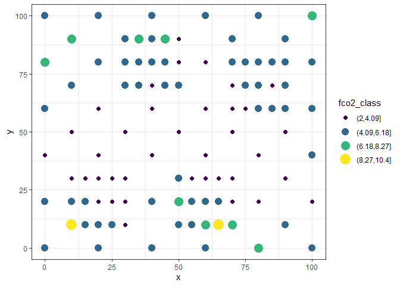<!-- -->

``` r
# Mostrar os dois gradeados....
dados_geo |>
  mutate(
    fco2_class = cut(fco2,4)
  ) |>
  ggplot(aes(x=x, y=y,
             color=fco2_class,
             size=fco2_class)) +
  geom_point() +
  theme_bw() +
  scale_color_viridis_d() +
  facet_wrap(~tratamento)
```

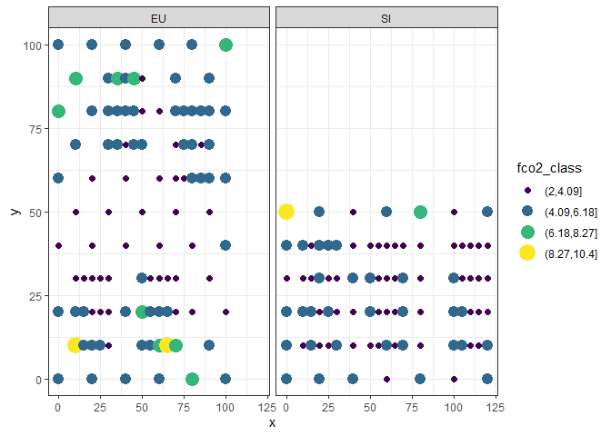<!-- -->

### 7) Realize a estatística descritiva dos dados, contendo, `N, Média, Mediana, Mínimo, Máximo, Variância, Desvio Padrão, Assimetria, Curtose e Coeficiente de Variação`.

``` r
# Estatísticas Descritivas para fco2
dados_geo |>
  filter(tratamento == "EU") |>
  summarise(
    N = n(),
    Media = mean(fco2, na.rm = TRUE),
    Mediana = median(fco2, na.rm = TRUE),
    Menor = min(fco2, na.rm = TRUE),
    Maior = max(fco2, na.rm = TRUE),
    Variancia = var(fco2, na.rm = TRUE),
    Desvio_Padrao = sd(fco2, na.rm = TRUE),
    Assimetria = agricolae::skewness(fco2),
    Curtose = agricolae::kurtosis(fco2),
    CV = 100*Desvio_Padrao/Media
  )
#> # A tibble: 1 × 10
#>       N Media Mediana Menor Maior Variancia Desvio_Padrao Assimetria Curtose
#>   <int> <dbl>   <dbl> <dbl> <dbl>     <dbl>         <dbl>      <dbl>   <dbl>
#> 1   102  4.65    4.53  2.01  10.4      1.92          1.39       1.16    3.03
#> # ℹ 1 more variable: CV <dbl>
```

### 8) Crie uma função para a estatística descritiva e aplique-a a todas as variáveis de interesse no banco de dados por meio das funções `summarise` e `across`.

``` r
dados_geo |>
  filter(tratamento == "EU") |>
  summarise(
    across(
      fco2:k, my_estat_desc
    )
  )
#> # A tibble: 4 × 7
#>     fco2      ts     us     mo     p_h p_resina       k
#>    <dbl>   <dbl>  <dbl>  <dbl>   <dbl>    <dbl>   <dbl>
#> 1 102    102     102    102    102       102    102    
#> 2   4.65  24.4    10.6   31.3    4.29      6.07   1.33 
#> 3   1.92   0.100   4.45  34.7    0.190     6.10   0.207
#> 4   1.39   0.316   2.11   5.89   0.436     2.47   0.455
```

## Premissas ou pressupostos da análise geoestatística.

A análise geoestatística é baseada na teoria das **variáveis
regionalizadas**, que é uma função numérica com distribuição espacial,
que varia de um ponto a outro com continuidade aparente, mas cujas
variações não podem ser representadas por uma função matemática simples
(MATHERON, 1963).

Uma variável regionalizada é uma variável aleatória que assume
diferentes valores, de acordo com a sua posição na área de estudo.

Se todos os valores de uma variável regionalizada forem considerados em
todos os pontos dentro de uma área amostral, a variável regionalizada é
apenas uma de infinitas variáveis aleatórias.

Esse conjunto é chamado de **função aleatória (FA)** e é simbolizado por
$Z(x_i)$. Na prática, quando retiramos uma amostra de solo em um local
com coordenadas definidas, temos apenas uma única realização da função
aleatória (FA).

Para estimar valores em locais não amostrados, deve-se introduzir as
restrições de **estacionaridade estatística**. A existência de
estacionaridade permite que o experimento possa ser repetido mesmo que
as amostras sejam coletadas em pontos diferentes, pois elas pertencem à
mesma população, com os mesmos momentos estatísticos (VIEIRA, 2000).

Em resumo, temos que os métodos geoestatísticos são ótimos quando os
dados são:

> **normalmente distribuídos** e estacionários (média e variância não
> variam significativamente no espaço).

Desvios significativos da normalidade e da estacionariedade podem causar
problemas, portanto é sempre importante começar a análise estudando o
histograma ou algum gráfico similar para checar a normalidade e o mapa
dos valores no espaço para checar a ocorrência de tendências
significativas.

### 9) Crie o histograma da variável `fco2`. Adicione os valores de `média`, `mediana`, `primeiro` e `terceiro quartil` no histograma na forma de linhas verticais.

``` r
dados_geo |>
  filter(tratamento == "EU") |>
  pull(fco2) |>
  quantile() # median()  mean()
#>      0%     25%     50%     75%    100% 
#>  2.0060  3.6740  4.5310  5.3695 10.3560


dados_geo |>
  filter(tratamento == "EU") |>
  ggplot(aes(x=fco2)) +
  geom_histogram(bins=15,fill="lightgray",color="black") +
  theme_bw() +
  geom_vline(xintercept = c(4.65, 4.53, 3.67, 5.36),
             linetype=2,
             color= c("red","blue" ,"blue" ,"blue"),
             lwd = 1)
```

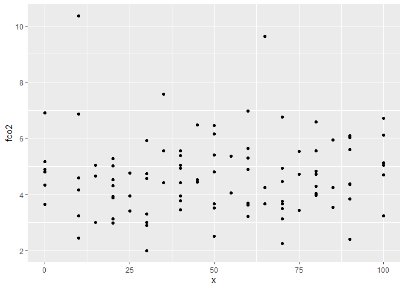<!-- -->

### 10) Crie o gráfico Quantil-Quantil (QQ-plot) para auxiliar a interpretação da normalidade.

``` r
dados_geo |>
  filter(tratamento == "EU") |>
  ggplot(aes(sample = fco2)) +
  stat_qq() +
  stat_qq_line(color="blue",lwd=2) +
  theme_bw()
```

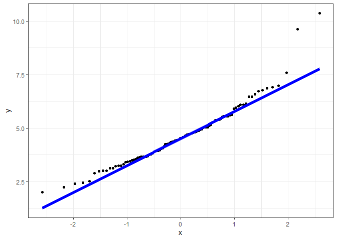<!-- -->

### 11) Realize o teste de normalidade dos dados para `fco2`.

``` r
dados_geo |>
  filter(tratamento == "EU") |>
  pull(fco2) |>
  shapiro.test() # teste de normalidade
#> 
#>  Shapiro-Wilk normality test
#> 
#> data:  pull(filter(dados_geo, tratamento == "EU"), fco2)
#> W = 0.93666, p-value = 0.0001034
```

### 12) Verifique a presença de tendência nos dados em função das coordenadas `x` e `y`.

``` r
dados_geo |>
  filter(tratamento == "EU") |>
  ggplot(aes(x=x, y=fco2)) +
  geom_point() +
  theme_bw()
```

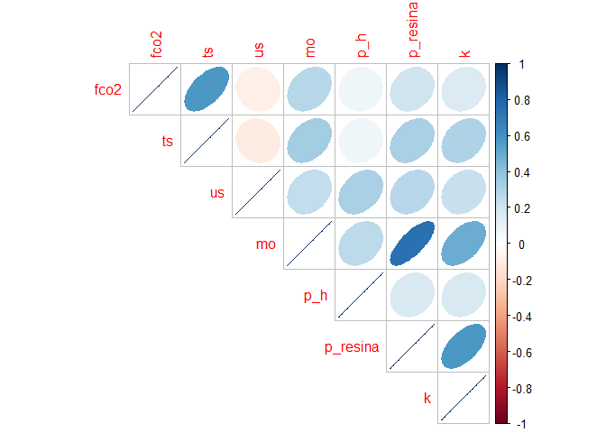<!-- -->

``` r
dados_geo |>
  filter(tratamento == "EU") |>
  ggplot(aes(x=y, y=fco2)) +
  geom_point() +
  theme_bw()
```

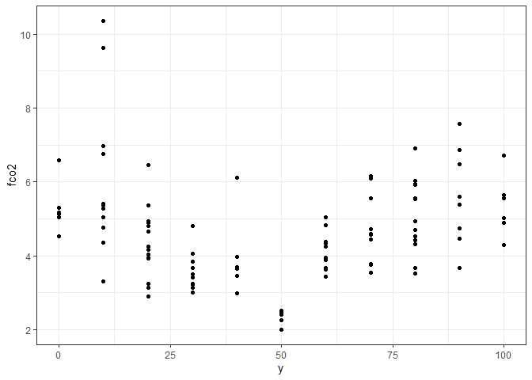<!-- -->

### 13) Realize a análise de regressão linear entre fco2 e as coordenadas x e y.

``` r
dados_geo |>
  filter(tratamento == "EU") |>
  lm(formula = fco2 ~ x) |>
  summary.lm()
#> 
#> Call:
#> lm(formula = fco2 ~ x, data = filter(dados_geo, tratamento == 
#>     "EU"))
#> 
#> Residuals:
#>     Min      1Q  Median      3Q     Max 
#> -2.6034 -0.9864 -0.0901  0.7055  5.7902 
#> 
#> Coefficients:
#>             Estimate Std. Error t value Pr(>|t|)    
#> (Intercept) 4.543933   0.277501  16.374   <2e-16 ***
#> x           0.002182   0.004789   0.456     0.65    
#> ---
#> Signif. codes:  0 '***' 0.001 '**' 0.01 '*' 0.05 '.' 0.1 ' ' 1
#> 
#> Residual standard error: 1.392 on 100 degrees of freedom
#> Multiple R-squared:  0.002072,   Adjusted R-squared:  -0.007907 
#> F-statistic: 0.2077 on 1 and 100 DF,  p-value: 0.6496
```

``` r
dados_geo |>
  filter(tratamento == "EU") |>
  lm(formula = fco2 ~ y) |>
  summary.lm()
#> 
#> Call:
#> lm(formula = fco2 ~ y, data = filter(dados_geo, tratamento == 
#>     "EU"))
#> 
#> Residuals:
#>     Min      1Q  Median      3Q     Max 
#> -2.6495 -0.9722 -0.1563  0.7747  5.7915 
#> 
#> Coefficients:
#>             Estimate Std. Error t value Pr(>|t|)    
#> (Intercept) 4.541814   0.260549  17.432   <2e-16 ***
#> y           0.002273   0.004493   0.506    0.614    
#> ---
#> Signif. codes:  0 '***' 0.001 '**' 0.01 '*' 0.05 '.' 0.1 ' ' 1
#> 
#> Residual standard error: 1.392 on 100 degrees of freedom
#> Multiple R-squared:  0.002553,   Adjusted R-squared:  -0.007422 
#> F-statistic: 0.2559 on 1 and 100 DF,  p-value: 0.614
```

## Medidas da dispersão conjunta de duas variáveis X e Y

As medidas de dispersão conjunta de duas variáveis, como X e Y,
referem-se à extensão em que os valores dessas variáveis se afastam de
seus valores médios simultaneamente. Algumas medidas comuns incluem a
covariância e a correlação.

### Covariância

A covariância $(Cov)$ indica a direção da relação linear entre duas
variáveis. Se for positiva, sugere uma relação positiva (quando uma
variável aumenta, a outra também tende a aumentar); se for negativa,
indica uma relação negativa (uma variável aumenta enquanto a outra
diminui).

Onde $X_i$ e $Y_i$ são os valores individuais das variáveis $X$ e $Y$,
$\bar{X}$ e $\bar{Y}$ são as médias de $X$ e $Y$, e $n$ é o número de
observações.

$$
Cov(X,Y) = \frac{1}{n}\sum\limits_{i=1}^n(X_i - \bar{X})(Y_i - \bar{Y})
$$

### Correlação

A correlação $(r)$ normaliza a covariância para estar entre $-1$ e $1$,
facilitando a interpretação. Um valor próximo de $1$ indica uma forte
relação positiva, $-1$ indica uma forte relação negativa, e $0$ indica
ausência de relação linear.

$$
r=\frac{\sum\limits_{i=1}^n(X_i - \bar{X})(Y_i - \bar{Y})}{\sqrt{\sum\limits_{i=1}^n(X_i - \bar{X})^2\sum\limits_{i=1}^n(Y_i - \bar{Y})^2}}
$$

### 14) Crie a matriz de correlação entre todas as variáveis numéricas do banco de dados.

``` r
dados_geo |>
  filter(tratamento == "EU") |>
  select(fco2:k) |>
  plot()
```

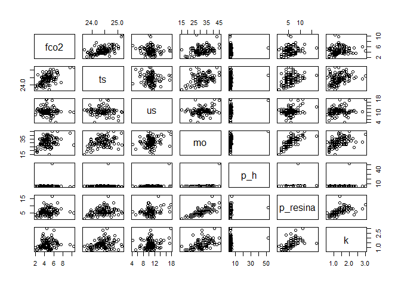<!-- -->

``` r
dados_geo |>
  filter(tratamento == "EU") |>
  select(fco2:k) |>
  cor() |>
  corrplot(method = "ellipse",
           type = "upper")
```

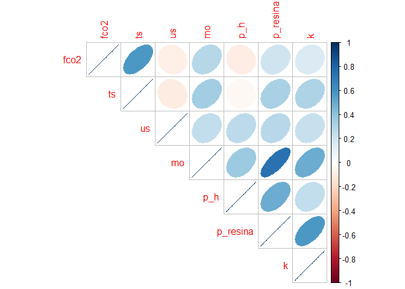<!-- -->

``` r
dados_geo |>
  filter(tratamento == "EU") |>
  select(fco2:k) |>
  GGally::ggpairs() +
  theme_bw()
```

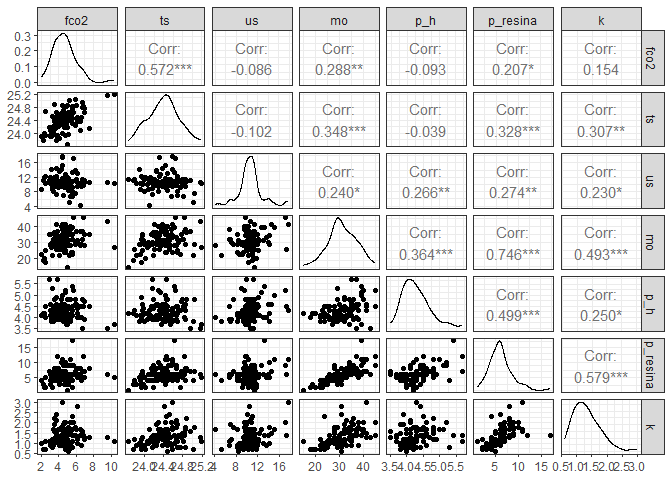<!-- --> \##
Definições em geoestatística

> Geoestatística lida com dados autocorrelacionados espacialmente.

> Autocorrelação: correlação entre elementos de uma série com outros
> elementos da mesma série separados por uma uma determinada distância.
> (Oxford American Dictionary)

Covariância e a correlação são medidas de similaridade entre duas
variáveis. Para estender este conceito para medidas de similaridade
espacial, considere um gráfico de dispersão em que os pares de dados
representam medidas da mesma variável separadas por uma distância $h$
uma da outra.

Esta distância é geralmente denominada de `lag`, como usado nas series
temporais.


## O semivariograma experimental (variograma experimental)

Ao contrário das funções de covariância e correlação, as quais medem a
similaridade, o semivariograma experimental $\gamma(h)$ mede
dissimilaridade média entre dados separados por um vetor $h$, ou seja,

$$
\gamma(h) = \frac{1}{2N(h)} \sum \limits_{i=1}^{N(h)}\left[ z(x_i) -z(x_i + h)\right]^2
$$

Sendo $z(x_i)$ e $z(x_i + h)$ os valores de cauda e da cabeça,
respectivamente e $N(h)$ o número de pares de pontos separados pela
distância $h$.

### 15) Vamos construir um semivariograma experimental:

#### 15.1) Extraia os vetores `x`, `y` e `z`.

``` r
x <- dados_geo |>
  filter(tratamento == "EU") |>
  pull(x)

y <- dados_geo |>
  filter(tratamento == "EU") |>
  pull(y)

z <- dados_geo |>
  filter(tratamento == "EU") |>
  pull(fco2)
```

#### 15.2) Cosntrua as matrizes de distância e de valor de gamma.

``` r
matriz_dist <- matrix(0,ncol=102,nrow=102)
matriz_gamma <- matrix(0,ncol=102,nrow=102)
```

#### 15.3) Calcule a matriz de distância $D$ entre todos os pontos amostrais e a matriz de valores de gamma $\gamma$. Lembrando que

$$D = \sqrt{(X_2-X_1)^2+(Y_2-Y_1)^2}$$ e

$$\gamma = \left[ z(x_i) -z(x_i + h)\right]^2$$

, respectivamente:

``` r
for(i in 1:102){
  for(j in 1:102){
    matriz_dist[i,j] = sqrt((x[i]-x[j])^2 + (y[i]-y[j])^2)
    matriz_gamma[i,j] = (z[i]-z[j])^2
  }
}
```

``` r
table(matriz_dist) %/% 2 |>
  plot()
abline(h=30, col="red", lty =2)
```

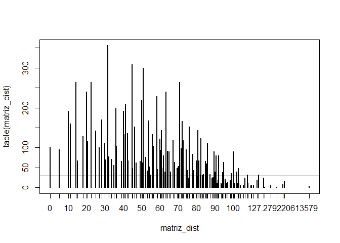<!-- -->

recomenda-se um núemro de pares de ponto em uma dada distância de
separação $h$ sempre maior que $30$.

#### 15.4) Calcule $h$, $N(h)$ e $\gamma(h)$.

``` r
lag <- 5
active_lag_distance <- 60
h <- seq(5, active_lag_distance, lag)
n_h <- h
gamma_h <- h
for(i in seq_along(h)){
  if(i == 1){
    filtro <- matriz_dist > 0 & matriz_dist <= h[i]
  }else{
    filtro <- matriz_dist > h[i-1] & matriz_dist <= h[i]
  }
  n_h[i] <- sum(filtro)/2
  gamma_h [i] <- sum(matriz_gamma[filtro])/2/n_h[i]/2
}
```

#### 15.5) Construa o semivariograma experimental $h$ vs $\gamma(h)$.

``` r
tibble(n_h,h,gamma_h) |>
  ggplot(aes(x=h,y=gamma_h)) +
  geom_point(size=3) +
  theme_bw()
```

<!-- -->

O gráfico de acima é denominado **semivariograma experimental**, o qual
exibe um comportamento puramente aleatório ou sistemático que pode ser
descrito por modelos matemáticos teóricos (linear, esférico,
exponencial, gaussiano e lei de potência).

## Ajuste de modelos matemáticos ao semivariograma experimental

O gráfico do semivariograma experimental, $\hat{\gamma}(h)$, é formado
por uma série de valores, sobre os quais se objetiva ajustar uma função.
É importante que o modelo ajustado represente a tendência de
$\hat{\gamma}(h)$ em relação a $h$.

O procedimento de ajuste não é direto e automático, como no caso de uma
regressão, por exemplo, mas sim interativo, pois nesse processo faz-se
um primeiro ajuste e verifica-se a adequação do modelo teórico.
Dependendo do ajuste obtido, pode-se ou não redefinir o modelo, até
obter um que seja considerado satisfatório.

Os principais modelos a serem ajustados são:

#### a) Efeito Pepita:

$$\begin{cases}
\hat{\gamma}(h) = 0 \text{ se }  h=0 \\
\hat{\gamma}(h) = Cte \text{ caso contrário }
\end{cases}$$

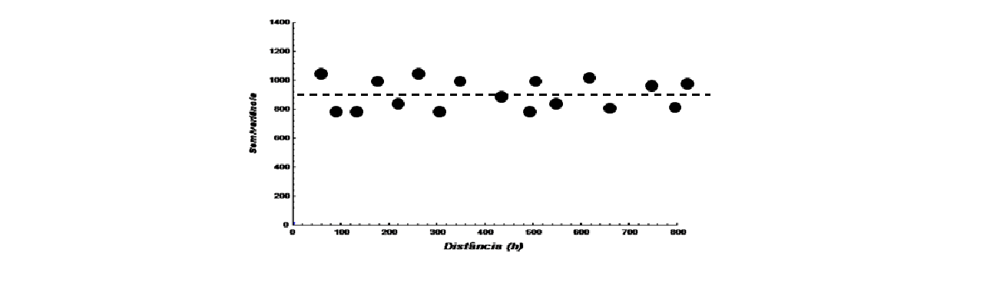

#### b) Modelo exponencial:

\$\$ (h) = b(h)^c 0 \< c \< 2 h

\$\$ 

#### c) Modelo exponencial:

$$\hat{\gamma}(h) = C_0 + C_1 \left[1- exp\left({-3 \frac{h}{a}}\right) \right], h > 0$$

#### d) Modelo esférico:

$$\begin{cases}
\hat{\gamma}(h) = C_0 + C_1 \left[exp\left(\frac{3}{2}(\frac{h}{a})-\frac{1}{2}(\frac{h}{a})^3\right)\right], 0 \leq h \leq a \\
\hat{\gamma}(h) = C_0 + C_1, h>a
\end{cases}$$

#### e) Modelo Gaussiano:

$$\hat{\gamma}(h) = C_0 + C_1 \left[1- exp(- \frac{h^2}{a^2}) \right], h > 0$$
O modelo esférico alcança o valor do patamar $(C_0+C_1)$ no valor de
alcance $(a)$ especificado. Os modelos exponencial e gaussiano se
aproximam do patamar assintoticamente, com a representando o alcance
prático, ou seja, a distância na qual a semivariância alcança $95\%$ do
valor do patamar.

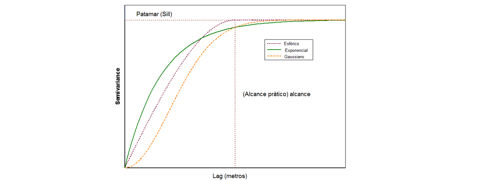

## Interpretação dos parâmetros

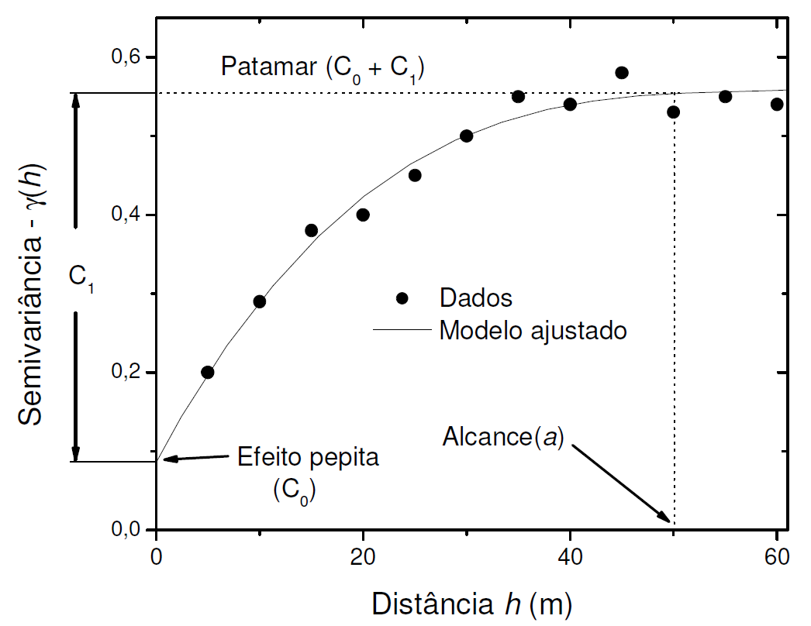

Para variáveis que apresentam dependência espacial, espera-se que os
valores de $Z(x_i) – Z(x_i + h)$ aumentem com a distância $h$ até
determinada distância, a partir da qual os valores estabilizam.

O valor de semivariância, na qual ocorre a estabilização do
semivariograma, é denominado de **patamar (sill)**, representado pelo
símbolo $C_0 + C_1$, sendo aproximadamente igual ao valor da estimativa
da variância dos dados analisados.

A distância $h$ na qual ocorre a estabilização do semivariograma é
denominada de **alcance (range)**, simbolizado por $a$, e define o
limite da dependência espacial (autocorrelação). Na prática, pontos cuja
distância entre eles **seja maior** que o valor de $a$, não apresentam
autocorrelação espacial, ou seja, são aleatórios.

O **efeito pepita (nugget effect)**, representado pelo símbolo $C_0$, é
o valor de semivariância encontrado no intercepto do modelo ajustado com
o eixo $Y$. Teoricamente, este valor deve ser zero para uma distância de
separação $(h)$ igual a zero; entretanto, **erros de amostragem** e a
**variabilidade na pequena** escala podem causar desvio do zero para
esse parâmetro. Portanto, o efeito pepita representa a **quantidade de
variância não explicada** ou modelada como correlação espacial.

O valor $C_1$ representa a estrutura de variabilidade espacial dos
dados.

## Interpretação dos modelos

**Modelo Exponencial** - descreve uma $FA$ que é bem errática à pequenas
distâncias, e a sua correspondente realização apresentada na figura a
seguir, evidencia considerável variabilidade na pequena escala.


**Modelos Esférico** - descreve uma $FA$ que é menos errática em
pequenas distâncias, e sua correspondente realização pode ser verificada
abaixo.

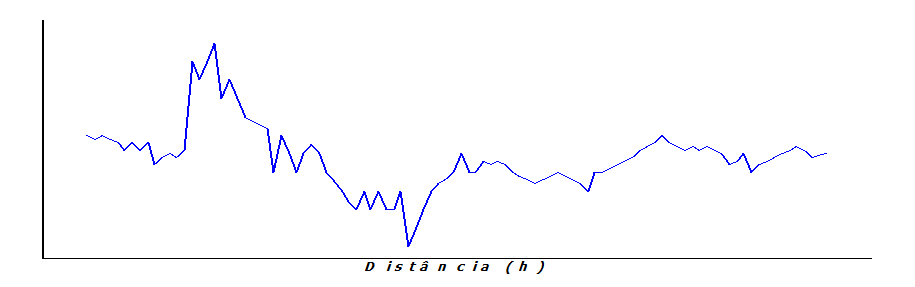

**Modelo Gaussiano** descreve uma $FA$ que é extremamente contínua, o
seu semivariograma é tangencial ao eixo x na origem, e cresce
suavemente. A sua correspondente realização, figura abaixo é suave e
levemente ondulada.

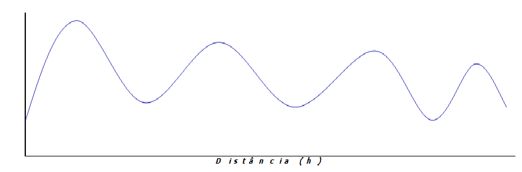

### 16) Utilizando as funções `coordinates()` e `variogram()` dos pacotes `{sp}` e `{gstat}`, construa o semivariograma experimental $h$ vs $\gamma(h)$, não esqueça de adicionar o número de pares de pontos de cada valor estimado de semivariância para futuras inspeções.

``` r
# Criando o arquivo necessário somente x, y, e z
df_aux <- dados_geo |> 
  select(x, y, fco2) |> 
  rename(z=fco2) 
class(df_aux)
#> [1] "tbl_df"     "tbl"        "data.frame"

coordinates(df_aux) = ~x + y
class(df_aux)
#> [1] "SpatialPointsDataFrame"
#> attr(,"package")
#> [1] "sp"
```

``` r
# Criando a fórmula para
formula <- z~1

# Criando o semivariograma experimental
semivariograma_experimental <- variogram(formula, data=df_aux,
                                         width = 9,
                                         cutoff=100,
                                         cressie=TRUE)
semivariograma_experimental |> 
  ggplot(aes(x=dist,y=gamma)) +
  geom_point() +
  theme_bw() +
  annotate("text", x=semivariograma_experimental$dist, 
           y=semivariograma_experimental$gamma*.98, 
           label = semivariograma_experimental$np)
```

<!-- --> \### 17)
Ajuste os modelos esférico, exponencial e gaussiano ao semivariogrma
experimental anteriormente apresentado. Utilize as funções
`fit.variogram`, `vgm` e `variogramLine`, pertencentes ao pacote
`{gstat}`.

## Ajuste Esférico

``` r
modelo_ajustado <- fit.variogram(semivariograma_experimental,
                                 vgm(model = "Sph",nugget = 0.5,
                                     psill = 1.2, range = 50 ))
preditos <- variogramLine(object = modelo_ajustado, maxdist = 100)

my_fitted_semivar <- semivariograma_experimental |> 
  ggplot(aes(x=dist,y=gamma)) +
  geom_point() +
  geom_line(data = preditos, aes(x = dist, y = gamma)) +
  theme_bw()
my_fitted_semivar
```

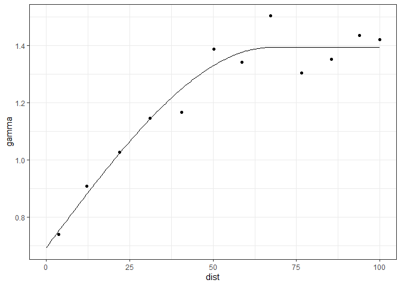<!-- --> \### 18)
Extraia os parâmetros dos modelos ajustados e adicione-os como uma
anotação no semivariograma.

``` r
# Extraindo os parâmetros do modelo
sse <- attr(modelo_ajustado, "SSErr")## Soma de Quadrado dos Resíduos
c0 <- modelo_ajustado$psill[[1]]## Valor de Nugget
patamar <- sum(modelo_ajustado$psill)## Valor de Patamar
alcance <- modelo_ajustado$range[[2]]## Alcance

## Nomes dos parâmetros
nomes <- c("C0", "C0+C1", "Range", "SSE")

## vetor de valores
vetor_par <- c(c0, patamar, alcance, sse)

## Plotando o semivariograma
my_fitted_semivar +
  annotate("text",x=rep(50,4),
           y=seq(.8,1,.06),
           label=paste0(nomes,"= ",round(vetor_par,4)),size=5) +
  labs(x="h",
       y = expression(paste(hat(gamma),"(h)")))
```

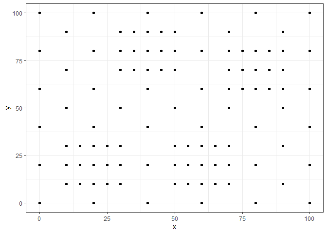<!-- -->

## Resumo do realizado até aqui

A ideia marcante da geoestatística é bem simples. Ela consiste nos
seguintes passos:

### 1º Passo

Defina uma área/local $A$, considerada homogênea o suficiente para a
garantir a interpolação dentro dela, ou seja,


### 2º Passo

Examine todos os dados medidos dentro de $A$ para calcular as
características- $h$ da variabilidade espacial, isto é, calcule os
valores do semivariograma experimental.

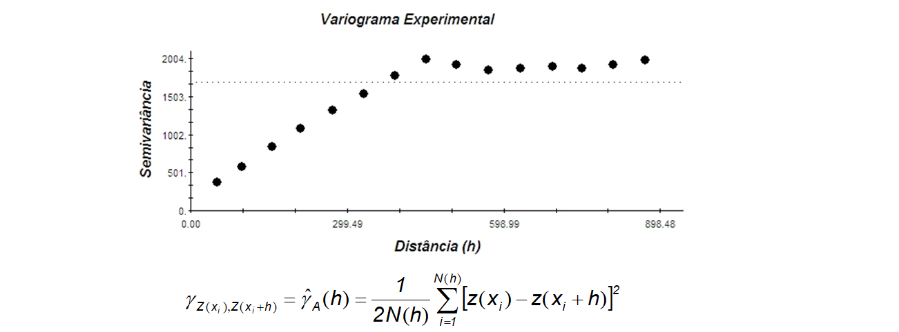

### 3º Passo

Modele o semivariograma experimental com uma função **avaliável** para
todos os vetores de distância $h$.

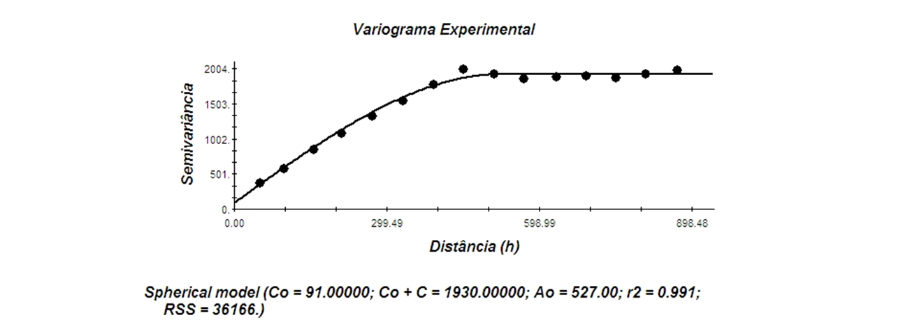

### Considerações finais sobre o semivariograma

Os passos mais importantes e, por isto mesmo, os que mais trazem
conseqüências em qualquer estudo geoestatístico são:

#### Decisão de média ou estacionaridade

A decisão de estacionariedade está implícita em todas as estatísticas,
ela não é particular da abordagem geoestatística. Esta decisão permite
definir um conjunto de dados (área A) sobre os quais as médias
experimentais e proporções serão calculadas e é assumido representativa
da população como um todo, não de qualquer particular locação individual
$(x \in A)$.

#### Hipótese intrinseca de Matheron (1965)

A hipótese intrínseca assume que o incremento

$$
Z(x+h) - Z(x)
$$

tem média zero, ou seja,

$$
E[Z(x+h) - Z(x)] = 0
$$

e uma variância finita que não depende do local $x$,

$$
Var[Z(x+h) - Z(x)] = E[Z(x+h) - Z(x)]^2 = 2\gamma(h)
$$

#### Direções na geoestatística

As convenções direcionais usadas na geoestatística são mostradas na
Figura abaixo

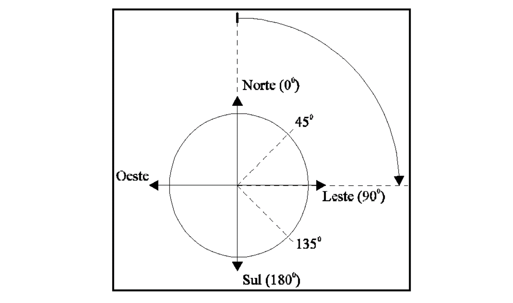

**MODELO ISOTRÓPICO** - Semivariograma só depende da distância $h$. Um
único modelo modela a variabilidade em todas as direções.

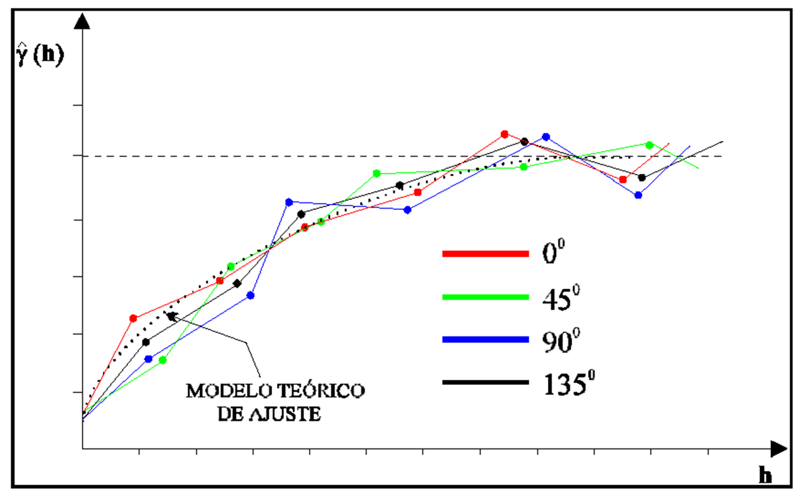

**MODELO ANISOTRÓPICO** – A modelo aplicado ao semivariograma
experimental depende da distância de separação e da direção.

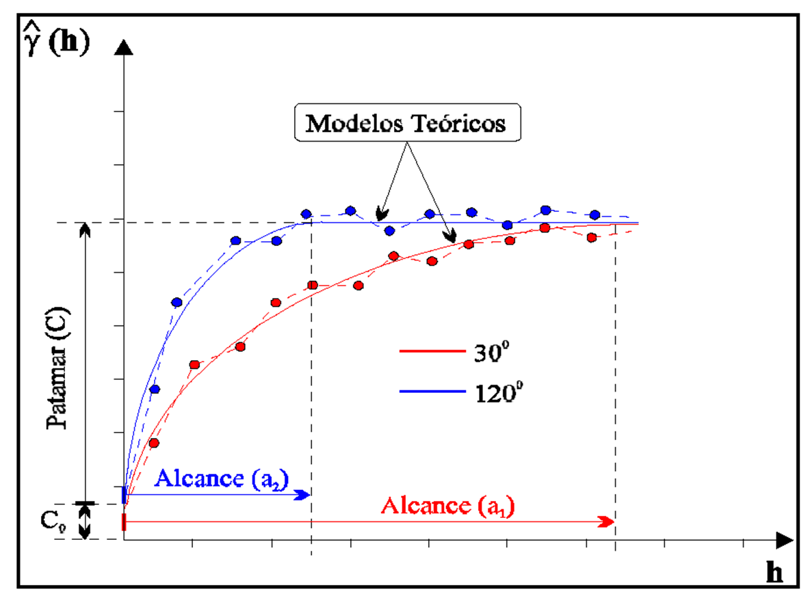

O variograma ao longo da direção 30º, por exemplo, de um canal de
sedimentação, apresentará menor variabilidade do que na direção 120º,
perpendicular à continuidade, correspondentemente, é observado maior
correlação na direção da sedimentação.

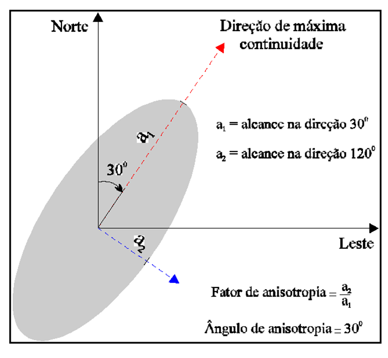

## 4º Passo - Krigagem Ordinária

Estimativa em locais não amostrados

Use este modelo $\hat{\gamma}(h)$, ou o modelo de covariância $C(h)$,
para a tradicional técnica de regressão, de krigagem.

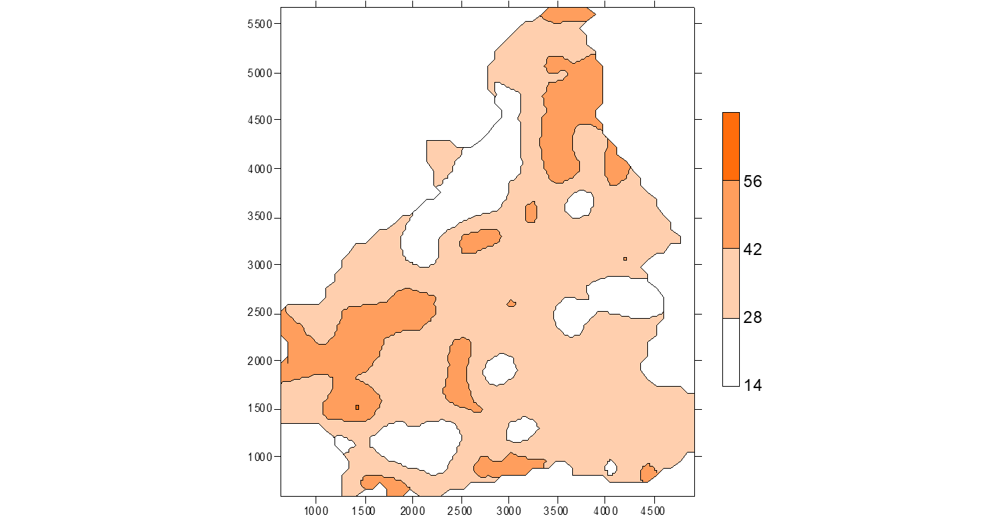

#### Resumidamente: Passos da modelagem da variabilidade espacial


Conhecido o semivariograma, e havendo dependência espacial entre as
amostras pode-se estimar valores da propriedade $Z$ em qualquer ponto do
campo de estudo, sem tendência e com variância mínima. O método de
estimação é denominado de **KRIGAGEM**, nome dado por MATHERON (1963) em
homenagem ao engenheiro de minas sul-africano KRIGE.

### ESTIMAÇÃO LOCAL: colocação do problema

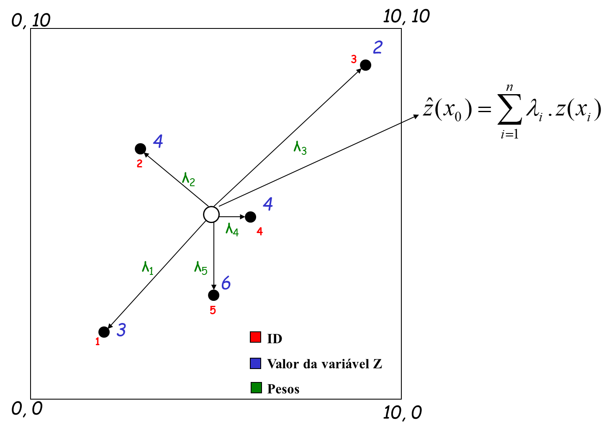 \### Estimação Local: Krigagem

$$
\hat{Z}(X_0) = \lambda_1Z(X_1) + \lambda_2Z(X_2)+ \cdots + \lambda_kZ(X_k) = \sum \limits_{i = 1}^k \lambda_iZ(X_i)
$$

Os pesos são escolhidos de forma que a estimativa $\hat{Z}(X_0)$ seja
**não viciada** e a variância do erro $\sigma_e^2$ da estimativa seja
menor que qualquer outra combinação linear dos valores observados, ou
seja:

$$
E[\hat{Z}(X_0) - Z(X_0)] = 0 \text{ e } \\
\sigma^2_e = Var[\hat{Z}(X_0) - Z(X_0)] = E[\hat{Z}(X_0) - Z(X_0)] \text{ seja mínima}
$$

Trabalhando algebricamente estas duas expressões, chegamos às expressões
que forma o sistema de krigagem, que pode ser esrito em função do
semivariograma $\gamma(h)$, sabendo-se que $\gamma(h) = C(0) - C(h)$

$$
\begin{cases}
\sum \limits_i \lambda_i(x_i,x_j) - \mu = \gamma(x_i,x_0) i = 1,2, \cdots, N \\
\sum \limits_i \lambda_i = 1
\end{cases}
$$

E a variância da estimação fica:

$$
\sigma^2_{\hat{Z}(X_0)} = \sum \limits_i^N \lambda_i\gamma(X_i,X_0) + \mu
$$

Sistema de krigagem na notação matricial.

**Matriz de semivariância entre as amostras** $$[\gamma]=\begin{bmatrix}
\gamma(X_1,X_1) & \gamma(X_1,X_2) & \cdots & \gamma(X_1,X_N) & 1 \\
\gamma(X_2,X_1) & \gamma(X_2,X_2) &  &\gamma(X_2,X_N) & 1 \\
\vdots & & \ddots & \vdots & 1\\
\gamma(X_N,X_1) & \gamma(X_N,X_2) & \cdots & \gamma(X_N,X_N) & 1 \\
1 & 1 & 1 & 1 &0 \\
\end{bmatrix}$$

**Matriz de semivariância entre as amostras e o ponto a estimar**

$$[b]=\begin{bmatrix}
\gamma(X_1,X_0) \\
\gamma(X_2,X_0) \\
\vdots \\
\gamma(X_N,X_0) \\
1
\end{bmatrix}$$

**Matriz de ponderadores**

$$[\lambda]=\begin{bmatrix}
\lambda_1 \\
\lambda_2    \\
\vdots \\
\lambda_N \\
\mu
\end{bmatrix}$$

a Relação entre os sistema é escrita como:

$$
[\gamma][\lambda]=[b] \text{ ou seja: } \\
$$

$$
\begin{bmatrix}
\gamma(X_1,X_1) & \gamma(X_1,X_2) & \cdots & \gamma(X_1,X_N) & 1 \\
\gamma(X_2,X_1) & \gamma(X_2,X_2) &  &\gamma(X_2,X_N) & 1 \\
\cdots & & \ddots & \cdots & 1\\
\gamma(X_N,X_1) & \gamma(X_N,X_2) & \cdots & \gamma(X_N,X_N) & 1 \\
1 & 1 & 1 & 1 &0 \\
\end{bmatrix} \begin{bmatrix}
\lambda_1 \\
\lambda_2    \\
\cdots \\
\lambda_N \\
\mu
\end{bmatrix}= \begin{bmatrix}
\gamma(X_1,X_0) \\
\gamma(X_2,X_0) \\
\cdots \\
\gamma(X_N,X_0) \\
1
\end{bmatrix}$$

Então,

$$[\lambda] = [\gamma]^{-1}[b]$$

cuja solunção única é
$$\hat{Z}(X_0) = \sum \limits_i^N \hat{\lambda}_iZ(X_i)$$

e a expressão da variância da forma matricial fica:

$$
\sigma_e^2=[\gamma]^t[b]
$$ 

## 11 Referências

GOTWAY, C.A.; HARTFORD, A.H. 1996. Geostatistical methods for
incorporating auxiliary information in the prediction of spatial
variables. **J. Agric., Biol. Environ. Statis.**, 1: 17-39.

GOOVAERTS, P. **Geostatistics for natural resources evaluation**. New
York: Oxford University Press, p. 483, 1997.

ISAAKS, E. H.; SRIVASTAVA, R. M. **Applied geostatistics**. Nova York:
Oxford University Press, 1989. 561 p.

JOURNEL, A.G. **Fundamentals of geostatistics in five lessons**. Short
Course in Geology: Volume 8. American Geophysical Union, Washington,
p. 1 – 40, 1989.

MATHERON G. Principles of geostatistics. **Economic Geology**, 58, 1963,
1246-1266.

OLIVEIRA, C. F. **Variabilidade espacial da emissão de CO<sub>2</sub> e
estoque de carbono do solo em áreas de eucalipto e sistema
silvipastoril**. Dissertação de Mestrado, Agronomia, UNESP-FEIS, 2018.

VIEIRA, S. R. **Geoestatística em estudos de variabilidade espacial do
solo**. In: NOVAIS, R.F.; ALVAREZ, V. H.; SEHAFFER, C. E. G. R. (Ed).
Tópicos em ciência do solo. Viçosa: Sociedade Brasileira de Ciência do
Solo, 2000, v.1, p. 1 – 53.

WEBSTER, R., OLIVER, M. **Geostatistics for Environmental Sciences**.
San Francisco: John Wiley & Sons, p. 315, 2009.

# Agradecimentos

A todos os participantes e integrantes do grupo de pesquisa.


