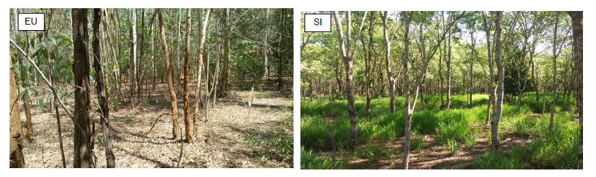
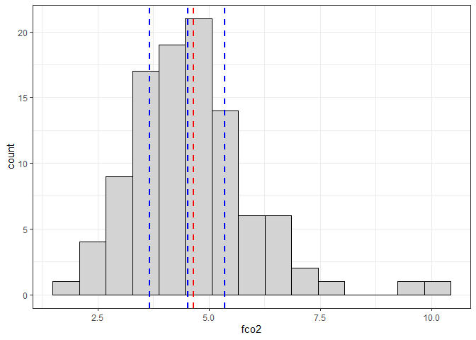

<!-- README.md is generated from README.Rmd. Please edit that file -->

# Cursos 02 - Introdução à Geoestatística

## Ministrante: Prof. Alan Rodrigo Panosso

## Data: 11/01/2024


## Motivação

A Geoestatística é uma ferramenta na análise espacial de dados,
desempenhando um importante papel na agricultura moderna. Ela combina
princípios estatísticos com informações geográficas para fornecer uma
compreensão mais profunda da variabilidade espacial de várias variáveis
ligados ao solo, à planta e mesmo à atmosfera.

Definida como um ramo da estatística aplicada que lida com a análise e
interpretação de dados espaciais. Ela permite a modelagem da
variabilidade espacial de fenômenos, descrevendo padrões espaciais,
correlações e distribuições geográficas. No contexto agronômico, é uma
ferramenta para compreender a heterogeneidade do solo e outros fatores
que influenciam nos mais diversos fenômenos associados.

O objetivo deste curso é capacitar os alunos a utilizar os princípios da
Geoestatística para analisar e interpretar dados espaciais. Ao final do
curso, os participantes serão capazes de aplicar métodos geoestatísticos
para mapear variáveis do solo, identificar padrões de distribuição
espacial e tomar decisões informadas sobre práticas agrícolas.

## Introdução

Considere os dois conjuntos de dados $A$ e $B$ e suas respectivas
estatísticas básicas.

| Estatística   |    A     |    B     |
|:--------------|:--------:|:--------:|
| n             | $15251$  | $15251$  |
| média         | $100,0$  | $100,0$  |
| desvio padrão |  $20,0$  |  $20,0$  |
| mediana       | $100,35$ | $100,92$ |
| Percentil 10  | $73,89$  | $73,95$  |
| Percentil 90  | $125,61$ | $124,72$ |


De acordo com estas evidências os dois conjuntos de dados são bastante
semelhantes.

 Comparação de seus respectivos gráficos de contornos
(padrões espaciais).

- O conjunto $A$ é mais acidentado que o conjunto de dados $B$.

- Não se pode afirmar que o conjunto de dados $A$ é mais variável do que
  o conjunto $B$, haja visto que os desvios padrões dos dois conjuntos
  de dados foram iguais.

- O conjunto $A$ muda mais rapidamente no espaço do que o conjunto $B$.

- As zonas contínuas altos valores (em vermelho) e as zonas de baixos
  valores (em azul) são, em média, menores para o conjunto $A$ do que do
  conjunto $B$.

- Estas diferenças podem ter um impacto significativo no delineamento
  amostral, na caracterização do local e na predição espacial em geral.

> **Portanto, não é surpresa que as estatísticas comuns falhem em
> reconhecer as diferenças da variável respostas dos dois exemplos de
> conjuntos de dados, isso porque a estatística descritiva e os
> histogramas não incorporam a localização espacial dos dados em seus
> cálculos**.

## Definição da Geoestatística

Assim, podemos entender a geoestatística como estudos de fenômenos que
variam no espaço e/ou no tempo, ou seja, é uma coleção de técnicas
numéricas, que lidam com a caracterização de atributos espaciais,
permitindo a descrição da continuidade espacial de fenômenos naturais e
fornece adaptações das técnicas da regressão para o entendimento desta
continuidade (ISAAKS; SRIVASTAVA, 1989; GOOVAERTS 1997).

Embora ela tenha sua origem na mineração, a geoestatística é uma parte
básica de muitas disciplinas científicas incluindo geosfísica, ciências
agronômicas, hidrologia e engenharia ambiental. A parte central da
geoestatística é a ideia de que **medidas mais próximas tendem a serem
mais parecidas do que valores observados em locais distantes**. A
geoestatística fornece métodos para quantificar esta correlação espacial
e incorporá-la na estimação e na inferência (GOTWAY; HARTFORD).

## O variograma

O variograma (ou semivariograma) é uma estatística descritiva
quantitativa que pode ser representada graficamente de tal forma que
caracteriza a continuidade espacial de um conjunto de dados.


Em outras palavras, a análise variográfica caracteriza a (auto)
correlação espacial.

## Descrição do Experimento

Para esse estudo, as áreas selecionadas pertencem à Fazenda de Ensino,
Pesquisa e Extensão (FEPE), da Faculdade de Engenharia de Ilha Solteira
(FEIS - UNESP), localizada no município de Selvíria, estado do Mato
Grosso do Sul.


No seu histórico, as áreas eram originalmente cobertas por vegetação
nativa do Cerrado até a década de 1970, quando, em 1978, foram
desmatadas e passaram a ser usadas para culturas anuais, como milho,
soja, algodão e adubos verdes, até 1986. Durante os anos de 1986-1987,
as áreas foram convertidas para os seguintes usos: floresta plantada de
eucalipto (EU) e sistema silvipastoril (SI), uma floresta plantada de
aroeira-vermelha (*Myracrodruon urundeuva*) em consórcio com capim
braquiária (*Brachiaria decumbens*). A área de EU (*Eucalyptus
camaldulensis*) foi formada em 26 de abril de 1986 e a área de SI foi
formada em dezembro de 1987.

No momento da realização das avaliações de emissão de CO<sub>2</sub> do
solo (FCO2) as áreas já haviam passado por mais de $30$ anos de mudança
de conversão. As determinações foram realizadas no período de 03 de
fevereiro a 17 de junho de 2017, Na imagem abaixo são apresentados os
dias de avaliação e os valores de precipitação (chuva em mm) ocorridas
no período.

Ao final do período de determinação da emissão de CO<sub>2</sub> do
solo, as amostras de solo foram coletadas e todos os atributos físicos e
químicos foram determinados.


Aspectos gerais das áreas de estudo, silvipastoril (SI) e eucalipto
(EU), ano de 2017, Município de Selvíria, Mato Grosso do Sul.



## Análise Exploratória

Um estudo clássico de geoestatística normalmente começa com uma
descrição detalhada da análise exploratória dos dados (mapas espaciais,
histogramas). Para isso vamos realizas análise descritiva da variável
emissão de CO<sub>2</sub> do solo na área de eucalipto. ([OLIVEIRA,
2018](https://repositorio.unesp.br/bitstreams/a13ca7aa-da94-4701-89aa-2bd2c8b4442d/download)
)

### 1) Carregue os pacotes necessários para as analises

``` r
library(tidyverse)
library(sp)
library(gstat)
```

### 2) Leia o banco de dados `geo_fco2.rds` disponível na pasta `data`. Utilize as funções glimpse e skim para um resumo inicial.

``` r
geo_fco2 <- read_rds("data/geo_fco2.rds")
glimpse(geo_fco2)
#> Rows: 188
#> Columns: 11
#> $ tratamento <chr> "EU", "EU", "EU", "EU", "EU", "EU", "EU", "EU", "EU", "EU",…
#> $ id         <dbl> 1, 2, 3, 4, 5, 6, 7, 8, 9, 10, 11, 12, 13, 14, 15, 16, 17, …
#> $ x          <dbl> 0, 20, 40, 60, 80, 100, 10, 15, 20, 25, 30, 50, 55, 60, 65,…
#> $ y          <dbl> 0, 0, 0, 0, 0, 0, 10, 10, 10, 10, 10, 10, 10, 10, 10, 10, 1…
#> $ fco2       <dbl> 5.164, 4.528, 5.048, 5.298, 6.576, 5.124, 10.356, 5.044, 5.…
#> $ ts         <dbl> 23.98, 24.68, 24.36, 24.56, 24.48, 24.48, 25.18, 24.86, 25.…
#> $ us         <dbl> 11.664611, 6.956307, 9.709750, 6.726249, 9.388142, 8.494171…
#> $ mo         <dbl> 31, 32, 39, 38, 29, 31, 27, 29, 22, 24, 29, 24, 35, 28, 43,…
#> $ p_h        <dbl> 4.4, 3.8, 3.7, 3.9, 4.0, 4.0, 3.7, 3.9, 3.8, 3.8, 3.9, 4.2,…
#> $ p_resina   <dbl> 3, 6, 6, 5, 4, 5, 5, 4, 4, 4, 5, 4, 9, 5, 6, 7, 5, 3, 4, 3,…
#> $ k          <dbl> 0.8, 1.9, 1.4, 0.9, 0.9, 0.6, 1.1, 0.8, 0.7, 0.7, 1.0, 0.8,…
skimr::skim(geo_fco2)
```

|                                                  |          |
|:-------------------------------------------------|:---------|
| Name                                             | geo_fco2 |
| Number of rows                                   | 188      |
| Number of columns                                | 11       |
| \_\_\_\_\_\_\_\_\_\_\_\_\_\_\_\_\_\_\_\_\_\_\_   |          |
| Column type frequency:                           |          |
| character                                        | 1        |
| numeric                                          | 10       |
| \_\_\_\_\_\_\_\_\_\_\_\_\_\_\_\_\_\_\_\_\_\_\_\_ |          |
| Group variables                                  | None     |

Data summary

**Variable type: character**

| skim_variable | n_missing | complete_rate | min | max | empty | n_unique | whitespace |
|:--------------|----------:|--------------:|----:|----:|------:|---------:|-----------:|
| tratamento    |         0 |             1 |   2 |   2 |     0 |        2 |          0 |

**Variable type: numeric**

| skim_variable | n_missing | complete_rate |  mean |    sd |    p0 |   p25 |   p50 |   p75 |   p100 | hist  |
|:--------------|----------:|--------------:|------:|------:|------:|------:|------:|------:|-------:|:------|
| id            |         0 |             1 | 47.84 | 27.79 |  1.00 | 24.00 | 47.50 | 71.00 | 102.00 | ▇▇▇▇▅ |
| x             |         0 |             1 | 54.52 | 33.79 |  0.00 | 25.00 | 55.00 | 80.00 | 120.00 | ▇▆▇▅▅ |
| y             |         0 |             1 | 38.14 | 27.46 |  0.00 | 20.00 | 30.00 | 60.00 | 100.00 | ▇▆▂▃▂ |
| fco2          |         0 |             1 |  4.39 |  1.26 |  2.01 |  3.54 |  4.23 |  5.03 |  10.36 | ▅▇▂▁▁ |
| ts            |         0 |             1 | 24.66 |  0.58 | 23.60 | 24.26 | 24.55 | 24.95 |  27.01 | ▅▇▃▁▁ |
| us            |         0 |             1 | 15.57 |  5.68 |  4.26 | 10.39 | 13.78 | 21.06 |  24.31 | ▁▇▁▂▆ |
| mo            |         0 |             1 | 30.33 |  5.00 | 15.00 | 27.00 | 30.00 | 33.00 |  45.00 | ▁▃▇▃▁ |
| p_h           |         0 |             1 |  4.40 |  3.51 |  3.50 |  3.90 |  4.00 |  4.30 |  52.00 | ▇▁▁▁▁ |
| p_resina      |         0 |             1 |  4.99 |  2.38 |  1.00 |  3.00 |  5.00 |  6.00 |  17.00 | ▇▆▂▁▁ |
| k             |         0 |             1 |  2.15 |  1.41 |  0.60 |  1.20 |  1.70 |  2.62 |  11.50 | ▇▂▁▁▁ |

### 3) Quantos tratamentos temos nesse banco de dados? Ou seja, qual o número de categorias presentes na coluna `tratamento` ?

### 4) Recorte do banco de dados, selecionar somente a área de eucalipto.

``` r
geo_fco2 %>% 
  filter(tratamento == "EU")
#> # A tibble: 102 × 11
#>    tratamento    id     x     y  fco2    ts    us    mo   p_h p_resina     k
#>    <chr>      <dbl> <dbl> <dbl> <dbl> <dbl> <dbl> <dbl> <dbl>    <dbl> <dbl>
#>  1 EU             1     0     0  5.16  24.0 11.7     31   4.4        3   0.8
#>  2 EU             2    20     0  4.53  24.7  6.96    32   3.8        6   1.9
#>  3 EU             3    40     0  5.05  24.4  9.71    39   3.7        6   1.4
#>  4 EU             4    60     0  5.30  24.6  6.73    38   3.9        5   0.9
#>  5 EU             5    80     0  6.58  24.5  9.39    29   4          4   0.9
#>  6 EU             6   100     0  5.12  24.5  8.49    31   4          5   0.6
#>  7 EU             7    10    10 10.4   25.2 10.2     27   3.7        5   1.1
#>  8 EU             8    15    10  5.04  24.9  9.43    29   3.9        4   0.8
#>  9 EU             9    20    10  5.27  25.0  5.21    22   3.8        4   0.7
#> 10 EU            10    25    10  4.77  24.6  9.36    24   3.8        4   0.7
#> # ℹ 92 more rows
```

### 5) Apresente o gradeado amostral.

``` r
geo_fco2 %>% 
  filter(tratamento == "EU") %>% 
  ggplot(aes(x,y)) + 
  geom_point() +
  theme_bw()
```

<!-- --> Observe a
disposição dos pontos amostrais.

### 6) Mapeie a emissão de CO<sub>2</sub> pelo tamanho e a cor dos marcadores de pontos.

``` r
geo_fco2 %>% 
  filter(tratamento == "EU") %>% 
  mutate(fco2_class = cut(fco2, 5)) %>% 
  ggplot(aes(x, y, size = fco2_class,
             color = fco2_class)) + 
  geom_point() +
  theme_bw() +
  scale_color_brewer(palette = "Oranges")
```

<!-- -->

### 7) Realize a estatística descritiva dos dados, contendo, `N, Média, Mediana, Mínimo, Máximo, Variância, Desvio Padrão, Assimetria, Curtose e Coeficiente de Variação`.

``` r
geo_fco2 %>% 
  filter(tratamento == "EU") %>% 
  summarise(
    N = n(),
    Media = mean(fco2),
    Mediana = median(fco2),
    Minimo = min(fco2),
    Maximo = max(fco2),
    Variancia = var(fco2),
    Desv_Pad = sd(fco2),
    Assimetria = agricolae::skewness(fco2),
    Curtose = agricolae::kurtosis(fco2),
    CV = 100*Desv_Pad/Media
  )
#> # A tibble: 1 × 10
#>       N Media Mediana Minimo Maximo Variancia Desv_Pad Assimetria Curtose    CV
#>   <int> <dbl>   <dbl>  <dbl>  <dbl>     <dbl>    <dbl>      <dbl>   <dbl> <dbl>
#> 1   102  4.65    4.53   2.01   10.4      1.92     1.39       1.16    3.03  29.8
```

### 8) Crie uma função para a estatística descritiva e aplique-a a todas as variáveis de interesse no banco de dados por meio das funções `summary` e `across`.

``` r
my_func <- function(x){
  media <- mean(x)
  vari <- var(x)
  c(`MEDIA` = media, `VARIANCIA` = vari)
}

geo_fco2 %>% 
  summarise(
    across(
      fco2:k,my_func))
#> # A tibble: 2 × 7
#>    fco2     ts    us    mo   p_h p_resina     k
#>   <dbl>  <dbl> <dbl> <dbl> <dbl>    <dbl> <dbl>
#> 1  4.39 24.7    15.6  30.3  4.40     4.99  2.15
#> 2  1.60  0.337  32.3  25.0 12.3      5.66  1.99
```

## Premissas ou pressupostos da análise geoestatística.

A análise geoestatística é baseada na teoria das **variáveis
regionalizadas**, que é uma função numérica com distribuição espacial,
que varia de um ponto a outro com continuidade aparente, mas cujas
variações não podem ser representadas por uma função matemática simples
(MATHERON, 1963).

Uma variável regionalizada é uma variável aleatória que assume
diferentes valores, de acordo com a sua posição na área de estudo.

Se todos os valores de uma variável regionalizada forem considerados em
todos os pontos dentro de uma área amostral, a variável regionalizada é
apenas uma de infinitas variáveis aleatórias.

Esse conjunto é chamado de **função aleatória** e é simbolizado por
$Z(x_i)$. Na prática, quando retiramos uma amostra de solo em um local
com coordenadas definidas, temos apenas uma única realização da função
aleatória.

Para estimar valores em locais não amostrados, devemos introduzir as
restrições de **estacionaridade estatística**. A existência de
estacionaridade permite que o experimento possa ser repetido mesmo que
as amostras sejam coletadas em pontos diferentes, pois elas pertencem à
mesma população, com os mesmos momentos estatísticos (VIEIRA, 2000).

Em resumo, temos que os métodos geoestatísticos são ótimos quando os
dados são:

> **normalmente distribuídos** estacionários (média e variância não
> variam significativamente no espaço).

Desvios significativos da normalidade e da estacionariedade podem causar
problemas, portanto é sempre importante começar o estudo dando uma
olhada no histograma ou algum gráfico similar para checar a normalidade
e o mapa dos valores no espaço para checar uma tendência significativa.

### 9) Crie o histograma da variável `fco2`.

``` r
geo_fco2 %>% 
  filter(tratamento == "EU") %>% 
  ggplot(aes(x=fco2)) +
  geom_histogram(bins=10)
```

<!-- -->

### 10) No histograma anterior, adicione os valores de `média`, `mediana`, `primeiro` e `terceiro quartil`.

### 11) Realize o teste de normalidade dos dados para `fco2`.

### 12) Verifique a presença de tendência nos dados em função das coordenadas `x` e `y`.

``` r
geo_fco2 %>% 
  filter(tratamento == "EU") %>% 
  ggplot(aes(x=x, y=fco2)) +
  geom_point()
```

<!-- -->

``` r
geo_fco2 %>% 
  filter(tratamento == "EU") %>% 
  ggplot(aes(x=y, y=fco2)) +
  geom_point()
```

<!-- -->

### 13) Realize de análise de regressão linear entre fco2 e as coordenadas x e y.

``` r
lm(fco2 ~ y,
   data = geo_fco2 %>% 
  filter(tratamento == "EU")) %>% 
  summary.lm()
#> 
#> Call:
#> lm(formula = fco2 ~ y, data = geo_fco2 %>% filter(tratamento == 
#>     "EU"))
#> 
#> Residuals:
#>     Min      1Q  Median      3Q     Max 
#> -2.6495 -0.9722 -0.1563  0.7747  5.7915 
#> 
#> Coefficients:
#>             Estimate Std. Error t value Pr(>|t|)    
#> (Intercept) 4.541814   0.260549  17.432   <2e-16 ***
#> y           0.002273   0.004493   0.506    0.614    
#> ---
#> Signif. codes:  0 '***' 0.001 '**' 0.01 '*' 0.05 '.' 0.1 ' ' 1
#> 
#> Residual standard error: 1.392 on 100 degrees of freedom
#> Multiple R-squared:  0.002553,   Adjusted R-squared:  -0.007422 
#> F-statistic: 0.2559 on 1 and 100 DF,  p-value: 0.614
```

## Referências

GOTWAY, C.A.; HARTFORD, A.H. 1996. Geostatistical methods for
incorporating auxiliary information in the prediction of spatial
variables. **J. Agric., Biol. Environ. Statis.**, 1: 17-39.

GOOVAERTS, P. **Geostatistics for natural resources evaluation**. New
York: Oxford University Press, p. 483, 1997.

ISAAKS, E. H.; SRIVASTAVA, R. M. **Applied geostatistics**. Nova York:
Oxford University Press, 1989. 561 p.

JOURNEL, A.G. **Fundamentals of geostatistics in five lessons**. Short
Course in Geology: Volume 8. American Geophysical Union, Washington,
p. 1 – 40, 1989.

MATHERON G. Principles of geostatistics. **Economic Geology**, 58, 1963,
1246-1266.

OLIVEIRA, C. F. **Variabilidade espacial da emissão de CO2 e estoque de
carbono do solo em áreas de eucalipto e sistema silvipastoril**.
Dissertação de Mestrado, Agronomia, UNESP-FEIS, 2018.

VIEIRA, S. R. **Geoestatística em estudos de variabilidade espacial do
solo**. In: NOVAIS, R.F.; ALVAREZ, V. H.; SEHAFFER, C. E. G. R. (Ed).
Tópicos em ciência do solo. Viçosa: Sociedade Brasileira de Ciência do
Solo, 2000, v.1, p. 1 – 53.

WEBSTER, R., OLIVER, M. **Geostatistics for Environmental Sciences**.
San Francisco: John Wiley & Sons, p. 315, 2009.
