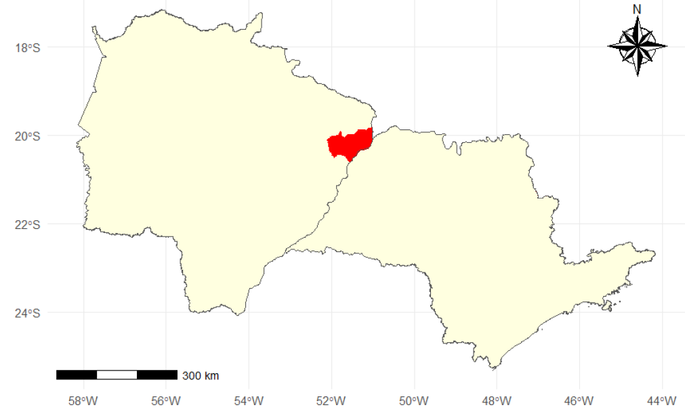

<!-- README.md is generated from README.Rmd. Please edit that file -->

```{r, include = FALSE}
knitr::opts_chunk$set(
  collapse = TRUE,
  warning = FALSE, 
  error = FALSE, 
  message = FALSE,
  echo = FALSE,
  comment = "#>"
)
```

## INTRODUÇÃO

### Motivação

A Geoestatística é uma ferramenta na análise espacial de dados, desempenhando um importante papel na agricultura moderna. Ela combina princípios estatísticos com informações geográficas para fornecer uma compreensão mais profunda da variabilidade espacial de várias variáveis ligadas ao solo, às plantas e mesmo à atmosfera. 

É definida como um ramo da estatística aplicada que lida com a análise e interpretação de dados espaciais. Ela permite a modelagem da variabilidade espacial de fenômenos, descrevendo padrões espaciais, correlações e distribuições geográficas. No contexto agronômico, é uma ferramenta para compreender a heterogeneidade do solo e outros fatores que influenciam nos mais diversos fenômenos associados.

Os métodos da estatística clássica são muito utilizados em Ciências da Terra, principalmente em Agronomia:

---

### Os procedimentos gerais utilizados na estatística clássica são: 

  + Selecionar um local típico ou representativo;

  + Retirar amostras ao acaso para evitar  tendências;

  + Evitar locais espacialmente variáveis para evitar erros;

  + Variabilidade é ruim;

  + Variabilidade é erro;

  + Conduzir o experimento num local típico que  represente um solo particular; etc.

---

### As Hipóteses básicas nas quais a maioria dos métodos da estatística clássica se baseiam são: 

  + Assumir uma distribuição de frequência;  

  + Erros de observações têm média zero;  

  + Os erros são independentes.  

Considere os dois conjuntos de dados $A$ e $B$ e suas respectivas estatísticas básicas.

Estatística |	A	| B 
:---| :---: | :---:
n	| $15251$	| $15251$
média | 	$100,0$	| $100,0$
desvio padrão	| $20,0$	| $20,0$
mediana	| $100,35$	| $100,92$
Percentil 10	| $73,89$	| $73,95$
Percentil  90	| $125,61$	| $124,72$

---


De acordo com estas evidências os dois conjuntos de dados são bastante semelhantes.

---


Comparação de seus respectivos gráficos de contornos (padrões espaciais).

--
  + O conjunto $A$ é mais acidentado que o conjunto de dados $B$.
  
--
  + Não se pode afirmar que o conjunto de dados $A$ é mais variável do que o conjunto $B$, haja visto que os desvios padrões dos dois conjuntos de dados foram iguais.
  
--
  + O conjunto $A$ muda mais rapidamente no espaço do que o conjunto $B$.
  
--
  + As zonas contínuas altos valores (em vermelho) e as zonas de baixos valores (em azul) são, em média, menores para o conjunto $A$ do que do conjunto $B$.
  
--
  + Estas diferenças podem ter um impacto significativo no delineamento amostral, na caracterização do local e na predição espacial em geral.

---

  > **Portanto, não é  surpresa que as estatísticas comuns falhem em reconhecer as diferenças da variável respostas dos dois exemplos de conjuntos de dados, isso porque a estatística descritiva e os histogramas não incorporam a localização espacial dos dados em seus cálculos**.  


---

## Definição da Geoestatística

Podemos entender a geoestatística como estudos de fenômenos que variam no espaço e/ou no tempo, ou seja, é uma coleção de técnicas numéricas, que lidam com a caracterização de atributos espaciais, permitindo a descrição da continuidade espacial de fenômenos naturais e fornece adaptações das técnicas da regressão para o entendimento desta continuidade (ISAAKS; SRIVASTAVA, 1989; GOOVAERTS, 1997). 

Embora ela tenha sua origem na mineração, a geoestatística é uma parte básica de muitas disciplinas científicas incluindo geosfísica, ciências agronômicas, hidrologia e engenharia ambiental. A parte central da geoestatística é a ideia de que **medidas mais próximas tendem a serem mais parecidas do que valores observados em locais distantes**. A geoestatística fornece métodos para quantificar esta correlação espacial e incorporá-la na estimação e na inferência (GOTWAY; HARTFORD).

Um conceito chave na Análise Espacial é a dependência espacial, e sua formulação matemática, a autocorrelação espacial. Estas noções partem do que Waldo Tobler chama de a "primeira lei da geografia": 

  > **"todas as coisas são parecidas, mas coisas mais próximas se parecem mais que coisas mais distantes"**.

---

### O variograma 

O variograma (ou semivariograma) é uma estatística descritiva quantitativa que pode ser representada graficamente de tal forma que caracteriza a continuidade espacial de um conjunto de dados.  


Em outras palavras, a análise variográfica caracteriza a (auto)correlação espacial.

---

### Descrição do Experimento

Para esse curso foi selecionado um estudo desenvolvido em áreas pertencentes à Fazenda de Ensino, Pesquisa e Extensão (FEPE), da Faculdade de Engenharia de Ilha Solteira (FEIS - UNESP), localizada no município de Selvíria, estado do Mato Grosso do Sul.


---

No seu histórico, as áreas eram originalmente cobertas por vegetação nativa do Cerrado até a década de 1970, quando, em 1978, foram desmatadas e passaram a ser usadas para culturas anuais, como milho, soja, algodão e adubos verdes, até 1986. Durante os anos de 1986-1987, as áreas foram convertidas para os seguintes usos: floresta plantada de eucalipto (EU) e sistema silvipastoril (SI), uma floresta plantada de aroeira-vermelha (*Myracrodruon urundeuva*) em consórcio com capim braquiária (*Brachiaria decumbens*). A área de EU (*Eucalyptus camaldulensis*) foi formada em 26 de abril de 1986 e a área de SI foi formada em dezembro de 1987.

No momento da realização das avaliações de emissão de CO~2~ do solo (FCO2) as áreas já haviam passado por mais de $30$ anos de mudança de conversão. As determinações foram realizadas no período de 03 de fevereiro a 17 de junho de 2017, Na imagem abaixo são apresentados os dias de avaliação e os valores de precipitação (chuva em mm) ocorridas no período. 

---


Ao final do período de determinação da emissão de CO~2~ do solo, as amostras de solo foram coletadas e todos os atributos físicos e químicos foram determinados.

Aspectos gerais das áreas de estudo, silvipastoril (SI) e eucalipto (EU), ano de 2017, Município de Selvíria, Mato Grosso do Sul.

---


---

## Mãos à obra


```{r, out.width="60%"}
knitr::include_graphics("https://media1.tenor.com/m/iCqG_iT-h48AAAAC/bills-ugh.gif")
```

---

## Análise Exploratória

Um estudo clássico de geoestatística normalmente começa com uma descrição detalhada da análise exploratória dos dados (mapas espaciais, histogramas). Para isso vamos realizas análise descritiva da variável emissão de CO~2~ do solo na área de eucalipto. ([OLIVEIRA, 2018](https://repositorio.unesp.br/bitstreams/a13ca7aa-da94-4701-89aa-2bd2c8b4442d/download) )


### 1) Carregue os pacotes necessários para as analises

```{r}
# Instalar pacotes necessários
# install.packages("tidyverse")
# install.packages("sp")
# install.packages("gstat")
# install.packages("corrplot")
# install.packages("skimr")
# install.packages("agricolae")

# Carregar os pacotes
library(tidyverse)
library(sp)
library(gstat)
library(corrplot)
source("../R/my-functions.R")
```

### 2) Leia o banco de dados `geo_fco2.rds` disponível na pasta `data`. Utilize as funções `glimpse` e `skim`, dos pacotes `{dplyr}` e `{skimr}` para a apresentação de um resumo inicial do banco de dados.


```{r}
# Lendo o banco de dados
dados_geo <- read_rds("../data/geo_fco2.rds")
glimpse(dados_geo)
skimr::skim(dados_geo)
```

### 3) Quantos tratamentos temos nesse banco de dados? Ou seja, qual o número de categorias presentes na coluna `tratamento` ?
```{r}
# Número de categorias de tratamentos
dados_geo |>
  pull(tratamento) |>
  unique()
```

### 4) Filtrar do banco de dados, selecionar somente as observações referentes à área de eucalipto.

```{r}
# Filtrar as observações para o tratamento "EU"
dados_geo |>
  filter(tratamento == "EU")
```

### 5) Apresente o gradeado amostral.

```{r}
dados_geo |>
  filter(tratamento == "EU") |>
  ggplot(aes(x=x, y=y)) +
  geom_point() +
  theme_bw()
```
Observe a disposição dos pontos amostrais.

### 6) Mapeie a emissão de CO~2~ pelo tamanho e a cor dos marcadores de pontos.

```{r}
dados_geo |>
  filter(tratamento == "EU") |>
  mutate(
    mo_class = cut(mo,4)
  ) |>
  ggplot(aes(x=x, y=y, color=mo_class, size=mo_class)) +
  geom_point() +
  theme_bw() +
  scale_color_viridis_d()
```


```{r}
# Mostrar os dois gradeados....
dados_geo |>
  mutate(
    mo_class = cut(mo,4)
  ) |>
  ggplot(aes(x=x, y=y,
             color=mo_class,
             size=mo_class)) +
  geom_point() +
  theme_bw() +
  scale_color_viridis_d() +
  facet_wrap(~tratamento, scale = "free",ncol=1)
```

### 7) Realize a estatística descritiva dos dados, contendo, `N, Média, Mediana, Mínimo, Máximo, Variância, Desvio Padrão, Assimetria, Curtose e Coeficiente de Variação`.

```{r}
# Estatísticas Descritivas para fco2
dados_geo |>
  filter(tratamento == "EU") |>
  summarise(
    N = n(),
    Media = mean(mo, na.rm = TRUE),
    Mediana = median(mo, na.rm = TRUE),
    Menor = min(mo, na.rm = TRUE),
    Maior = max(mo, na.rm = TRUE),
    Variancia = var(mo, na.rm = TRUE),
    Desvio_Padrao = sd(mo, na.rm = TRUE),
    Assimetria = agricolae::skewness(mo),
    Curtose = agricolae::kurtosis(mo),
    CV = 100*Desvio_Padrao/Media
  )
```

### 8) Crie uma função para a estatística descritiva e aplique-a a todas as variáveis de interesse no banco de dados por meio das funções `summarise` e `across`.

```{r}
dados_geo |>
  filter(tratamento == "EU") |>
  summarise(
    across(
      fco2:k, my_estat_desc
    )
  )
```

## Premissas ou pressupostos da análise geoestatística.

A análise geoestatística é baseada na teoria das **variáveis regionalizadas**, que é uma função numérica com distribuição espacial, que varia de um ponto a outro com continuidade aparente, mas cujas variações não podem ser representadas por uma função matemática simples (MATHERON, 1963). 

Uma variável regionalizada é uma variável aleatória que assume diferentes valores, de acordo com a sua posição na área de estudo.

Se todos os valores de uma variável regionalizada forem considerados em todos os pontos dentro de uma área amostral, a variável regionalizada é apenas uma de infinitas variáveis aleatórias. 

Esse conjunto é chamado de **função aleatória (FA)** e é simbolizado por $Z(x_i)$. Na prática, quando retiramos uma amostra de solo em um local com coordenadas definidas, temos apenas uma única realização da função aleatória (FA). 

Para estimar valores em locais não amostrados, deve-se introduzir as restrições de **estacionaridade estatística**. A existência de estacionaridade permite que o experimento possa ser repetido mesmo que as amostras sejam coletadas em pontos diferentes, pois elas pertencem à mesma população, com os mesmos momentos estatísticos (VIEIRA, 2000).

Em resumo, temos que os métodos geoestatísticos são ótimos quando os dados são:
	
> **normalmente distribuídos** e estacionários (média e variância não variam significativamente no espaço).

Desvios significativos da normalidade e da estacionariedade podem causar problemas, portanto é sempre importante começar a análise estudando o histograma ou algum gráfico similar para checar a normalidade e o mapa dos valores no espaço para checar a ocorrência de tendências significativas. 


### 9) Crie o histograma da variável `mo`. Adicione os valores de `média`, `mediana`, `primeiro` e `terceiro quartil` no histograma na forma de linhas verticais.

```{r}
mo_qnt <- dados_geo |>
  filter(tratamento == "EU") |>
  pull(mo) |>
  summary() # median()  mean()


dados_geo |>
  filter(tratamento == "EU") |>
  ggplot(aes(x=mo)) +
  geom_histogram(bins=15,fill="lightgray",color="black") +
  theme_bw() +
  geom_vline(xintercept = mo_qnt[-c(1,6)],
             linetype=2,
             color= c("blue","blue" ,"red" ,"blue"),
             lwd = 1)

```

### 10) Crie o gráfico Quantil-Quantil (QQ-plot) para auxiliar a interpretação da normalidade.

```{r}
dados_geo |>
  filter(tratamento == "EU") |>
  ggplot(aes(sample = mo)) +
  stat_qq() +
  stat_qq_line(color="blue",lwd=2) +
  theme_bw()
```

### 11) Realize o teste de normalidade dos dados para `mo`.
```{r}
dados_geo |>
  filter(tratamento == "EU") |>
  pull(mo) |>
  shapiro.test() # teste de normalidade
```

### 12) Verifique a presença de tendência nos dados em função das coordenadas `x` e `y`.

```{r}
dados_geo |>
  filter(tratamento == "EU") |>
  ggplot(aes(x=x, y=mo)) +
  geom_point() +
  theme_bw()
```

```{r}
dados_geo |>
  filter(tratamento == "EU") |>
  ggplot(aes(x=y, y=mo)) +
  geom_point() +
  theme_bw()
```

### 13) Realize a análise de regressão linear entre fco2 e as coordenadas x e y.
```{r}
dados_geo |>
  filter(tratamento == "EU") |>
  lm(formula = mo ~ x) |>
  summary.lm()
```


```{r}
dados_geo |>
  filter(tratamento == "EU") |>
  lm(formula = mo ~ y) |>
  summary.lm()
```

## Medidas da dispersão conjunta de duas variáveis X e Y

As medidas de dispersão conjunta de duas variáveis, como X e Y, referem-se à extensão em que os valores dessas variáveis se afastam de seus valores médios simultaneamente. Algumas medidas comuns incluem a covariância e a correlação.

###  Covariância

A covariância $(Cov)$ indica a direção da relação linear entre duas variáveis. Se for positiva, sugere uma relação positiva (quando uma variável aumenta, a outra também tende a aumentar); se for negativa, indica uma relação negativa (uma variável aumenta enquanto a outra diminui).


Onde $X_i$ e $Y_i$ são os valores individuais das variáveis $X$ e $Y$, $\bar{X}$ e $\bar{Y}$ são as médias de $X$ e $Y$, e $n$ é o número de observações.

$$
Cov(X,Y) = \frac{1}{n}\sum\limits_{i=1}^n(X_i - \bar{X})(Y_i - \bar{Y})
$$

### Correlação

A correlação $(r)$ normaliza a covariância para estar entre $-1$ e $1$, facilitando a interpretação. Um valor próximo de $1$ indica uma forte relação positiva, $-1$ indica uma forte relação negativa, e $0$ indica ausência de relação linear.

$$
r=\frac{\sum\limits_{i=1}^n(X_i - \bar{X})(Y_i - \bar{Y})}{\sqrt{\sum\limits_{i=1}^n(X_i - \bar{X})^2\sum\limits_{i=1}^n(Y_i - \bar{Y})^2}}
$$


### 14) Crie a matriz de correlação entre todas as variáveis numéricas do banco de dados.

```{r}
dados_geo |>
  filter(tratamento == "EU") |>
  select(fco2:k) |>
  plot()
```


```{r}
dados_geo |>
  filter(tratamento == "EU") |>
  select(fco2:k) |>
  cor() |>
  corrplot(method = "ellipse",
           type = "upper")
```


```{r}
dados_geo |>
  filter(tratamento == "EU") |>
  select(fco2:k) |>
  GGally::ggpairs() +
  theme_bw()
```
## Definições em geoestatística

> Geoestatística lida com dados autocorrelacionados espacialmente.


> Autocorrelação: correlação entre elementos de uma série  com outros elementos da mesma série separados por uma  determinada distância. (Oxford American Dictionary)

Covariância e a correlação são medidas de similaridade entre duas variáveis. Para estender este conceito para medidas de similaridade espacial, considere um gráfico de dispersão em que os pares de dados representam medidas da mesma variável separadas por uma distância $h$ uma da outra. 

Esta distância é geralmente denominada de `lag`, como usado nas series temporais.

```{r}
transecto <- read_rds("../data/transecto.rds")
glimpse(transecto)
transecto |> 
  filter( y == 0) |> 
  ggplot(aes(x=x,y=arg)) +
  geom_line() +
  theme_bw()
```


```{r}
transecto |> 
  filter( y == 0) |> 
  select(x,arg) |> 
  mutate(
    arg_lag = create_lag(arg,1)
  ) |> 
    drop_na() |> 
  ggplot(aes(x=arg,y=arg_lag)) +
  geom_point() +
  theme_bw() +
  geom_smooth(method = "lm", 
              se=FALSE,
              formula = 'y~x' )
```


```{r}
transecto |> 
  filter( y == 0) |> 
  select(x,arg) |> 
  mutate(
    arg_lag = create_lag(arg,4)
  ) |> 
    drop_na() |> 
  ggplot(aes(x=arg,y=arg_lag)) +
  geom_point() +
  theme_bw() +
  geom_smooth(method = "lm", 
              se=FALSE,
              formula = 'y~x' )
```

```{r}
transecto |> 
  filter( y == 0) |> 
  select(x,arg) |> 
  mutate(
    arg_lag_1 = create_lag(arg,1),
    arg_lag_3 = create_lag(arg,3),
    arg_lag_5 = create_lag(arg,5),
    arg_lag_7 = create_lag(arg,7),
    arg_lag_9 = create_lag(arg,9),
    arg_lag_11 = create_lag(arg,11),
    arg_lag_13 = create_lag(arg,13),
    arg_lag_15 = create_lag(arg,15),
    arg_lag_17 = create_lag(arg,17)
  ) |> 
    drop_na() |> 
  select(-x) |> 
  cor() |> 
  corrplot(type = "upper")
```

> "A dispersão dos pontos em torno da linha de 45º, aumenta com o aumento da distância de separação entre os pontos. Esta dispersão reflete a variabilidade entre esses valores. Reflete a dissimilaridade dos dados para as distâncias h". 

### No mapeamento em duas dimensões


## O semivariograma experimental (variograma experimental)

Ao contrário das funções de covariância e correlação, as quais medem a similaridade, o semivariograma experimental $\gamma(h)$ mede dissimilaridade média entre dados separados por um vetor $h$, ou seja,

$$
\gamma(h) = \frac{1}{2N(h)} \sum \limits_{i=1}^{N(h)}\left[ z(x_i) -z(x_i + h)\right]^2
$$

Sendo $z(x_i)$ e $z(x_i + h)$ os valores de cauda e da cabeça, respectivamente e $N(h)$ o número de pares de pontos separados pela distância $h$.

### 15) Vamos construir um semivariograma experimental:

#### 15.1) Extraia os vetores `x`, `y` e `z`.

```{r}
x <- dados_geo |>
  filter(tratamento == "EU") |>
  pull(x)

y <- dados_geo |>
  filter(tratamento == "EU") |>
  pull(y)

z <- dados_geo |>
  filter(tratamento == "EU") |>
  pull(fco2)
```

#### 15.2) Cosntrua as matrizes de distância e de valor de gamma.


```{r}
matriz_dist <- matrix(0,ncol=102,nrow=102)
matriz_gamma <- matrix(0,ncol=102,nrow=102)
```

#### 15.3) Calcule a matriz de distância $D$ entre todos os pontos amostrais e a matriz de valores de gamma $\gamma$. Lembrando que

$$D = \sqrt{(X_2-X_1)^2+(Y_2-Y_1)^2}$$
e

$$\gamma = \left[ z(x_i) -z(x_i + h)\right]^2$$

, respectivamente:


```{r}
for(i in 1:102){
  for(j in 1:102){
    matriz_dist[i,j] = sqrt((x[i]-x[j])^2 + (y[i]-y[j])^2)
    matriz_gamma[i,j] = (z[i]-z[j])^2
  }
}
```

```{r}
table(matriz_dist) %/% 2 |>
  plot()
abline(h=30, col="red", lty =2)
```

recomenda-se um núemro de pares de ponto em uma dada distância de separação $h$ sempre maior que $30$.


#### 15.4) Calcule $h$, $N(h)$ e $\gamma(h)$.

```{r}
lag <- 5
active_lag_distance <- 60
h <- seq(5, active_lag_distance, lag)
n_h <- h
gamma_h <- h
for(i in seq_along(h)){
  if(i == 1){
    filtro <- matriz_dist > 0 & matriz_dist <= h[i]
  }else{
    filtro <- matriz_dist > h[i-1] & matriz_dist <= h[i]
  }
  n_h[i] <- sum(filtro)/2
  gamma_h [i] <- sum(matriz_gamma[filtro])/2/n_h[i]/2
}
```

#### 15.5) Construa o semivariograma experimental $h$ vs $\gamma(h)$.
```{r}
tibble(n_h,h,gamma_h) |>
  ggplot(aes(x=h,y=gamma_h)) +
  geom_point(size=3) +
  theme_bw()
```

O gráfico de acima é denominado **semivariograma experimental**, o qual exibe um comportamento puramente aleatório ou sistemático que pode ser descrito por modelos matemáticos teóricos (linear, esférico, exponencial, gaussiano e lei de potência).


## Ajuste de modelos matemáticos ao semivariograma experimental

O gráfico do semivariograma experimental, $\hat{\gamma}(h)$, é formado por uma série de valores, sobre os quais se objetiva ajustar uma função. É importante que o modelo ajustado represente a tendência de $\hat{\gamma}(h)$ em relação a $h$. 

O procedimento de ajuste não é direto e automático, como no caso de uma regressão, por exemplo, mas sim interativo, pois nesse processo faz-se um primeiro ajuste e verifica-se a adequação do modelo teórico. Dependendo do ajuste obtido, pode-se ou não redefinir o modelo, até obter um que seja considerado satisfatório.


Os principais modelos a serem ajustados são:

#### a) Efeito Pepita:

$$\begin{cases}
\hat{\gamma}(h) = 0 \text{ se }  h=0 \\
\hat{\gamma}(h) = Cte \text{ caso contrário }
\end{cases}$$


Semivariograma chamado de efeito pepita puro

#### b) Modelo exponencial:

$$\hat{\gamma}(h) = b(h)^c \text{ com } 0 < c < 2 \text{ e } h \geq 0$$


#### c) Modelo exponencial:

$$\hat{\gamma}(h) = C_0 + C_1 \left[1- exp\left({-3 \frac{h}{a}}\right) \right], h > 0$$

#### d) Modelo esférico:

$$\begin{cases}
\hat{\gamma}(h) = C_0 + C_1 \left[exp\left(\frac{3}{2}(\frac{h}{a})-\frac{1}{2}(\frac{h}{a})^3\right)\right], 0 \leq h \leq a \\
\hat{\gamma}(h) = C_0 + C_1, h>a
\end{cases}$$

#### e) Modelo Gaussiano:

$$\hat{\gamma}(h) = C_0 + C_1 \left[1- exp(- \frac{h^2}{a^2}) \right], h > 0$$
O modelo esférico alcança o valor do patamar $(C_0+C_1)$ no valor de alcance $(a)$ especificado. Os modelos exponencial e gaussiano  se aproximam do patamar assintoticamente, com  a representando o alcance prático, ou seja, a distância na qual a semivariância alcança $95\%$ do valor do patamar.


## Interpretação dos parâmetros


Para variáveis que apresentam dependência espacial, espera-se que os valores de $Z(x_i) – Z(x_i + h)$ aumentem com a distância $h$ até determinada distância, a partir da qual os valores estabilizam.

O valor de semivariância, na qual ocorre a estabilização do semivariograma, é denominado de **patamar (sill)**, representado pelo símbolo $C_0 + C_1$, sendo aproximadamente igual ao valor da estimativa da variância dos dados analisados.


A distância $h$ na qual ocorre a estabilização do semivariograma é denominada de **alcance (range)**, simbolizado por $a$, e define o limite da dependência espacial (autocorrelação). Na prática, pontos cuja distância entre eles **seja maior** que o valor de $a$, não apresentam autocorrelação espacial, ou seja, são aleatórios.

O **efeito pepita (nugget effect)**, representado pelo símbolo $C_0$, é o valor de semivariância encontrado no intercepto do modelo ajustado com o eixo $Y$. Teoricamente, este valor deve ser zero para uma distância de separação $(h)$ igual a zero; entretanto, **erros de amostragem** e a **variabilidade na pequena** escala podem causar desvio do zero para esse parâmetro. Portanto, o efeito pepita representa a **quantidade de variância não explicada** ou modelada como correlação espacial.

O valor $C_1$ representa a estrutura de variabilidade espacial dos dados.


## Interpretação dos modelos

**Modelo Exponencial** - descreve uma $FA$ que é bem errática à pequenas distâncias, e a sua correspondente realização apresentada na figura a seguir, evidencia considerável variabilidade na pequena escala.


**Modelos Esférico** - descreve uma $FA$ que é menos errática em pequenas distâncias, e sua correspondente realização pode ser verificada abaixo.
  


**Modelo Gaussiano** descreve uma $FA$ que é extremamente contínua, o seu semivariograma é tangencial ao eixo x na origem, e cresce suavemente. A sua correspondente realização, figura abaixo é suave e levemente ondulada.


### 16) Utilizando as funções `coordinates()` e `variogram()` dos pacotes `{sp}` e `{gstat}`, construa o semivariograma experimental $h$ vs $\gamma(h)$, não esqueça de adicionar o número de pares de pontos de cada valor estimado de semivariância para futuras inspeções.

### 17) Ajuste os modelos esférico, exponencial e gaussiano ao semivariogrma experimental anteriormente apresentado. Utilize as funções `fit.variogram`,  `vgm` e ` variogramLine`, pertencentes ao pacote `{gstat}`.


```{r}
# Construção do semivariogrma pela função variogram do
# pacote gstat
# Recorte do banco de dados com x, y, e z
df_aux <- dados_geo |>
  filter(tratamento == "EU") |>
  select(x, y, fco2) |>
  rename(z = fco2) # mude aqui para outro atributo, se necessário
class(df_aux)


# temos que passar df_aux para SpatialData uma vez que
# as funções do gstat trabalham com esse formato de dados
sp::coordinates(df_aux) = ~ x + y
head(df_aux)
class(df_aux)
mode(df_aux)

# criando a fórmula para o semivariograma
form <- z ~ 1

# criar o semivarigrama experimental
semi_exp <- gstat::variogram(form, df_aux,
                             cutoff=100,
                             width = 5)
semi_exp |>
  ggplot(aes(x=dist, y=gamma)) +
  geom_point(size=3) +
  theme_bw() +
  annotate("text",
           x=semi_exp$dist,
           y=semi_exp$gamma*0.98,
           label = semi_exp$np)
```

#Modelagem - Modelo Esférico
```{r}
# Modelagem - Modelo Esférico (aula)
mod_ajust <- fit.variogram(semi_exp,
                           vgm(model = "Sph",
                               nugget=0.5,
                               psill=1.8,
                               range=50)
                           )
linha_preditos <- variogramLine(mod_ajust,
                                maxdist = 100)
plot(linha_preditos)
semi_exp |>
  ggplot(aes(x=dist, y=gamma)) +
  geom_point(size=3) +
  theme_bw()+
  geom_line(data = linha_preditos,
            aes(x=dist, y=gamma),
            color="red")
```

## Modelagem - Modelo Exponencial (casa)

## Modelagem - Modelo Gaussiano (casa)

### 18) Extraia os parâmetros dos modelos ajustados e adicione-os como uma anotação no semivariograma.
```{r}
# Extração dos parâmetros
sse <- attr(mod_ajust, "SSErr") # soma quadrados resíduos
nugget <- mod_ajust$psill[1] # efeito pepita C0
sill <- sum(mod_ajust$psill) # patamar C0 + C1
alcance <- mod_ajust$range[2]

texto_par <- paste0(c("SQD","C0","C0+C1","a"),
                    " = ",
                    round(c(sse,nugget,sill,alcance),3)
                    )

semi_exp |>
  ggplot(aes(x=dist, y=gamma)) +
  geom_point(size=3) +
  theme_bw()+
  geom_line(data = linha_preditos,
            aes(x=dist, y=gamma),
            color="red") +
  annotate("text",x=50,
           y=seq(1,1.4,.12),
           label = texto_par,size=6)
```


## Resumo do realizado até aqui

A ideia marcante da geoestatística é bem simples. Ela consiste nos seguintes passos:

### 1º Passo 

Defina uma área/local $A$, considerada homogênea o suficiente para a garantir a interpolação dentro dela, ou seja,


### 2º Passo 

Examine todos os dados medidos dentro de $A$ para calcular as características- $h$ da variabilidade espacial, isto é, calcule os valores do semivariograma experimental.


### 3º Passo 

Modele o semivariograma experimental com uma função **avaliável** para todos os vetores de distância $h$.


### Considerações finais sobre o semivariograma

Os passos mais importantes e, por isto mesmo, os que mais trazem conseqüências em qualquer estudo geoestatístico são:

#### Decisão de média ou estacionaridade

A decisão de estacionariedade está implícita em todas as estatísticas, ela não é particular da abordagem geoestatística. Esta decisão permite definir um conjunto de dados (área A) sobre os quais as médias experimentais e proporções serão calculadas e é assumido representativa da população como um todo, não de qualquer particular locação individual $(x \in A)$. 

#### Hipótese intrinseca de Matheron (1965)

A hipótese intrínseca assume que o incremento

$$
Z(x+h) - Z(x)
$$

tem média zero, ou seja,

$$
E[Z(x+h) - Z(x)] = 0
$$

e uma variância finita que não depende do local $x$, 


$$
Var[Z(x+h) - Z(x)] = E[Z(x+h) - Z(x)]^2 = 2\gamma(h)
$$

#### Direções na geoestatística

As convenções direcionais usadas na geoestatística são mostradas na Figura abaixo


**MODELO ISOTRÓPICO** - Semivariograma só depende da distância $h$. Um único modelo modela a variabilidade em todas as direções. 


**MODELO ANISOTRÓPICO** – A modelo aplicado ao semivariograma experimental depende da distância de separação e da direção.


O variograma ao longo da direção 30º, por exemplo, de um canal de sedimentação, apresentará menor variabilidade do que na direção 120º, perpendicular à continuidade, correspondentemente, é observado maior correlação na direção da sedimentação. 


## 4º Passo - Krigagem Ordinária

Estimativa em locais não amostrados

Use este modelo $\hat{\gamma}(h)$, ou o modelo de covariância $C(h)$, para a tradicional técnica de regressão, de krigagem.


#### Resumidamente: Passos da modelagem da variabilidade espacial


Conhecido o semivariograma, e havendo dependência espacial entre as amostras pode-se estimar valores da propriedade $Z$ em qualquer ponto  do campo de estudo, sem tendência e com variância mínima.  O método de estimação é denominado de **KRIGAGEM**, nome dado por MATHERON (1963) em homenagem ao engenheiro de minas sul-africano KRIGE.

### ESTIMAÇÃO LOCAL: colocação do problema


### Estimação Local: Krigagem


$$
\hat{Z}(X_0) = \lambda_1Z(X_1) + \lambda_2Z(X_2)+ \cdots + \lambda_kZ(X_k) = \sum \limits_{i = 1}^k \lambda_iZ(X_i)
$$

Os pesos são escolhidos de forma que a estimativa $\hat{Z}(X_0)$ seja **não viciada** e a variância do erro $\sigma_e^2$ da estimativa seja menor que qualquer outra combinação linear dos valores observados, ou seja:

$$
E[\hat{Z}(X_0) - Z(X_0)] = 0 \text{ e } \\
\sigma^2_e = Var[\hat{Z}(X_0) - Z(X_0)] = E[\hat{Z}(X_0) - Z(X_0)] \text{ seja mínima}
$$

Trabalhando algebricamente estas duas expressões, chegamos às expressões que forma o sistema de krigagem, que pode ser esrito em função do semivariograma $\gamma(h)$, sabendo-se que $\gamma(h) = C(0) - C(h)$

$$
\begin{cases}
\sum \limits_i \lambda_i(x_i,x_j) - \mu = \gamma(x_i,x_0) i = 1,2, \cdots, N \\
\sum \limits_i \lambda_i = 1
\end{cases}
$$

E a variância da estimação fica:

$$
\sigma^2_{\hat{Z}(X_0)} = \sum \limits_i^N \lambda_i\gamma(X_i,X_0) + \mu
$$

Sistema de krigagem na notação matricial.


**Matriz de semivariância entre as amostras**

$$[\gamma]=\begin{bmatrix}
\gamma(X_1,X_1) & \gamma(X_1,X_2) & \cdots & \gamma(X_1,X_N) & 1 \\
\gamma(X_2,X_1) & \gamma(X_2,X_2) &  &\gamma(X_2,X_N) & 1 \\
\cdots & & \ddots & \cdots & 1\\
\gamma(X_N,X_1) & \gamma(X_N,X_2) & \cdots & \gamma(X_N,X_N) & 1 \\
1 & 1 & 1 & 1 &0 \\
\end{bmatrix}$$

**Matriz de semivariância entre as amostras e o ponto a estimar**

$$[b]=\begin{bmatrix}
\gamma(X_1,X_0) \\
\gamma(X_2,X_0) \\
\vdots \\
\gamma(X_N,X_0) \\
1
\end{bmatrix}$$

**Matriz de ponderadores**

$$[\lambda]=\begin{bmatrix}
\lambda_1 \\
\lambda_2    \\
\vdots \\
\lambda_N \\
\mu
\end{bmatrix}$$

a Relação entre os sistema é escrita como:

$$
[\gamma][\lambda]=[b] \text{ ou seja: } \\
$$

$$
\begin{bmatrix}
\gamma(X_1,X_1) & \gamma(X_1,X_2) & \cdots & \gamma(X_1,X_N) & 1 \\
\gamma(X_2,X_1) & \gamma(X_2,X_2) &  &\gamma(X_2,X_N) & 1 \\
\cdots & & \ddots & \cdots & 1\\
\gamma(X_N,X_1) & \gamma(X_N,X_2) & \cdots & \gamma(X_N,X_N) & 1 \\
1 & 1 & 1 & 1 &0 \\
\end{bmatrix} \begin{bmatrix}
\lambda_1 \\
\lambda_2    \\
\cdots \\
\lambda_N \\
\mu
\end{bmatrix}= \begin{bmatrix}
\gamma(X_1,X_0) \\
\gamma(X_2,X_0) \\
\cdots \\
\gamma(X_N,X_0) \\
1
\end{bmatrix}$$


Então, 

$$[\lambda] = [\gamma]^{-1}[b]$$

cuja solunção única é 
$$\hat{Z}(X_0) = \sum \limits_i^N \hat{\lambda}_iZ(X_i)$$ 

e a expressão da variância da forma matricial fica:

$$
\sigma_e^2=[\gamma]^t[b]
$$


### 19) Crie a região de adensamento, ou seja, um novo arquivo contendo a posição geográfica (pares de coordenadas) onde será realizada a estimativa via krigagem ordinária.
```{r}
dados_geo |>
  filter(tratamento == "EU") |>
  ggplot(aes(x=x,y=y)) +
  geom_point() +
  theme_bw()

menor_dist <- 1

grid_adensado <- expand.grid(
  x=seq(0,100,menor_dist),
  y=seq(0,100,menor_dist)
)

dados_geo |>
  filter(tratamento == "EU") |>
  ggplot(aes(x=x,y=y)) +
  geom_point() +
  geom_point( data = grid_adensado,
              aes(x=x,y=y),
              color="blue",
              size=1) +
  theme_bw()

# tranformar o grid_adensado em um objeto
# SpatiaData
sp::coordinates(grid_adensado) = ~ x+ y
```


### 20) Utilizando o algorítmo da KO, vamos estimar o atributo nos locais não amostrados (gradeado adensado).

```{r}
ko <- gstat::krige(form, df_aux,grid_adensado,
                   mod_ajust)
```


### 21) Apresente os padrões espaciais (mapa de ko) e o mapa da estimativa do erro.

```{r}
ko |>
  as_tibble() |>
  ggplot(aes(x=x,y=y)) +
  geom_tile(aes(fill= var1.pred)) +
  scale_fill_viridis_c() +
  labs(title = "FCO2")

ko |>
  as_tibble() |>
  ggplot(aes(x=x,y=y)) +
  geom_tile(aes(fill= var1.var)) +
  scale_fill_viridis_c() +
  labs(title = "FCO2 (desvios)")
```

## REFERÊNCIAS

GOTWAY, C.A.; HARTFORD, A.H. 1996. Geostatistical methods for incorporating auxiliary information in the prediction of spatial variables. **J. Agric., Biol. Environ. Statis.**, 1: 17-39.

GOOVAERTS, P. **Geostatistics for natural resources evaluation**. New York: Oxford University Press, p. 483, 1997.

ISAAKS, E. H.; SRIVASTAVA, R. M. **Applied geostatistics**. Nova York: Oxford University Press, 1989. 561 p.

JOURNEL, A.G. **Fundamentals of geostatistics in five lessons**. Short Course in Geology: Volume 8. American Geophysical Union, Washington, p. 1 – 40, 1989.

MATHERON G. Principles of geostatistics. **Economic Geology**, 58, 1963, 1246-1266.

OLIVEIRA, C. F. **Variabilidade espacial da emissão de CO~2~ e estoque de carbono do solo em áreas de eucalipto e sistema silvipastoril**. Dissertação de Mestrado, Agronomia, UNESP-FEIS, 2018.

VIEIRA, S. R. **Geoestatística em estudos de variabilidade espacial do solo**. In: NOVAIS, R.F.; ALVAREZ, V. H.; SEHAFFER, C. E. G. R. (Ed). Tópicos em ciência do solo. Viçosa: Sociedade Brasileira de Ciência do Solo, 2000, v.1, p. 1 – 53. 

WEBSTER, R., OLIVER, M. **Geostatistics for Environmental Sciences**. San Francisco: John Wiley & Sons, p. 315, 2009.

## Agradecimentos
